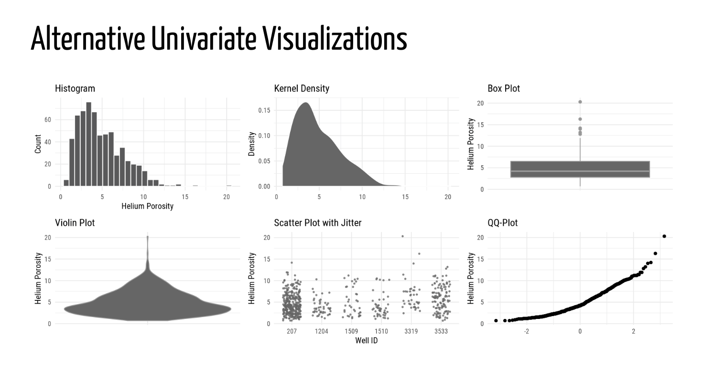

# SPE

Presentation for the May 17, 2018  SPE Calgary chapter meeting.
Visualizations in the Analysis Workflow

**If you are unsure where to go, you probably want [this](https://speidel-spe.updog.co).**

## Philosophy
This presentation follows the spirit of reproducible research. The data and graphs are fully reproducible.
R has been utilized 

## How-to
* The presentation code is contained in the file `Speidel.Rmd`. Clicking this file will open a version rendered by GitHub which will not render as a presentation.
* The data is in the `Data` folder.
* Figures are saved in the `Figures` folder.
* Additional material, such as fonts and other offline material, are in `libs` folder. 

