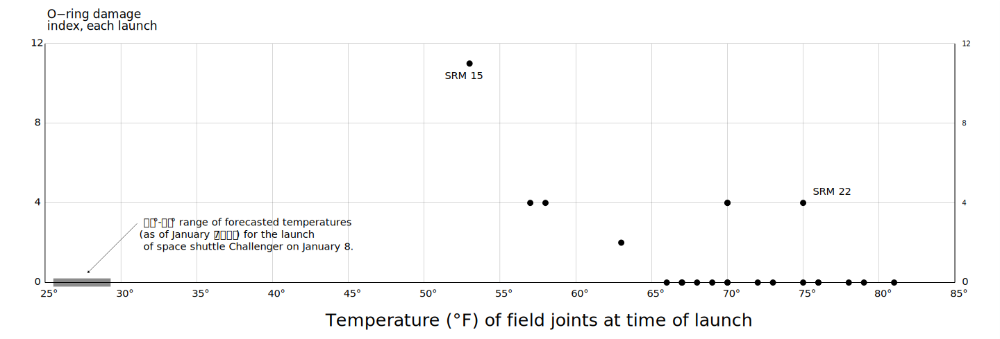

```{r setup, include=FALSE}
##------------------------------------------------------------------------------------------------------------
## Created by: Thomas Speidel
##------------------------------------------------------------------------------------------------------------

##------------------------------------------------------------------------------------------------------------
## Set common options
##------------------------------------------------------------------------------------------------------------
options(htmltools.dir.version = FALSE)

## Invalidate cache when the package version changes
options(htmltools.dir.version = FALSE)

knitr::opts_chunk$set(echo = FALSE, 
                      warning = FALSE, 
                      message = FALSE, 
                      fig.path = 'Figures/', 
                      strip.white = TRUE, 
                      dpi = 144)


##------------------------------------------------------------------------------------------------------------
# Set pretty looking numbers
##------------------------------------------------------------------------------------------------------------
knitr::knit_hooks$set(inline = function(x) {
      if(is.numeric(x)){
          return(prettyNum(x, big.mark=","))
      }else{
          return(x)
       }
   })

##------------------------------------------------------------------------------------------------------------
# Allow font awesome icons
##------------------------------------------------------------------------------------------------------------
htmltools::tagList(rmarkdown::html_dependency_font_awesome())


##------------------------------------------------------------------------------------------------------------
## LOAD PACKAGES
##------------------------------------------------------------------------------------------------------------
library(lubridate)
library(dplyr)
library(readr)
library(readxl)
library(scales) 
library(viridis)
library(tidyr)
library(ggplot2)
library(extrafont)
library(viridis)
library(knitr)
library(Hmisc)
library(rms)
library(kableExtra)
library(forcats)
library(patchwork)
library(GGally)


## Fonts
# font_import(pattern="[R/r]oboto")
# loadfonts(device="win")

```


class: inverse

# Agenda

<br>

1.   Visualizations: Objectives and Constraints

2.   Univariate Visualizations

3.   Bivariate Visualizations

4.   Tips & Best Practices

5.   References


---

class: inverse, center, middle

# 1. Visualizations: Objectives and Constraints

---

# First Goal of Visualizations

To summarize, communicate and engage (telling a story)


---

# Second Goal of Visualizations

To identify, understand, highlight features or relationships (helping the readers make up their mind) 

<br>


<small>
.footnote[[1] *Gelman, Unwin. 2013 <a href="www.tandfonline.com/doi/abs/10.1080/10618600.2012.761137"> <i class="fa fa-external-link"></i></a>*]
</small>
---

# To Persuade or to Inform?

We **cannot** achieve both effectiviely at the same time!

.pull-left[
###To Persuade
 
]

.pull-right[
###To Inform
 
]


<small>
.footnote[[1] *Spiegelhalter, Pearson, Short. 2011 <a href="https://vcg.seas.harvard.edu/files/pfister/files/infovis_submission251-camera.pdf"> <i class="fa fa-external-link"></i></a>*] 
</small>

---

# To Remember or to Understand?

It is possible to achieve both **if**: (1):

1.  Titles and supporting text should convey the message of a visualization 

2.  If used appropriately, **pictograms** do not interfere with understanding and can improve recognition

3.  Redundancy helps effectively communicate the message 

<div style="text-align:center"></div>


<small>
.footnote[[1] *Borkin et al. 2015<a href="http://slides.yihui.name/xaringan/zh-CN.html"> <i class="fa fa-external-link"></i></a>*] 
</small>

---

class: inverse, center, middle

<iframe width="647" height="546" src="Figures/nuclear.mp4" frameborder="0" allowfullscreen></iframe>

<small>
.footnote[[1] *Bob Rudis 2016<a href="https://rud.is/b/2016/03/26/nuclear-animations-in-r/"> <i class="fa fa-external-link"></i></a>*] 
</small>
---

class: inverse, center, middle

# 2. Univariate Visualizations

---

# Data

The dataset originates from Doublet (2001).


<small>


```{r}
##------------------------------------------------------------------------------------------------------------
## DATA
##------------------------------------------------------------------------------------------------------------
blasingame <- read_excel("Data/Blasingame.xls", sheet = "Whole Core Data (nounits)")

var.names <- tolower(colnames(blasingame))
var.names <- make.names(var.names, unique = TRUE, allow_ = FALSE)
colnames(blasingame) <- var.names

blasingame <- blasingame %>%
     mutate(well = as.integer(well)) %>%
     mutate(rtype = as.factor(rtype)) %>%
     mutate(program = as.factor(program))

# Add labels
blasingame <- upData(blasingame,
              labels = c(well = 'Well ID',
                         depth = 'Depth',
                         helium.porosity = "Helium Porosity",
                         gdens = "Density",
                         kmax = "Kmax Permeability",
                         k90 = "K90 Permeability",
                         rtype = "Rock Type"
                         ),
              units = c(depth = "ft",
                        helium.porosity = "%",
                        gdens = "g/cm3",
                        kmax = "md",
                        k90 = "md",
                        gr = "API",
                        rhob = "g/cm3",
                        pe = "b/e",
                        nphils = "dec",
                        lld = "Ohm",
                        lls = "Ohm"),
              moveUnits = TRUE,
              html = FALSE,
              print = FALSE)


## Sample
# kable(blasingame[1:5, ])
kable(blasingame[1:5, ], "html", align = "l") %>% kable_styling(bootstrap_options = c("striped", "hover", "condensed"))

## Sample data
b.sample <- blasingame %>%
     select(well,
            depth,
            helium.porosity,
            kmax,
            rtype
            )

```

.footnote[[2] *Thanks to D. Kaviani for pointing me to the data and for the preparatory work.*]

.footnote[[1] *Doublet, L.E. (2001) An Integrated Geologic and Engineering Characterization of the North Robertson (Clear Fork) Unit, Gaines
County, Texas. Petroleum Engineering PhD thesis, Texas A&amp;M University.*]

</small>

---
background-image: url(Figures/tukey.jpeg)
background-size: cover
class: inverse

<br><br><br><br><br><br><br><br><br><br>

# Exploratory Data Analysis (EDA)

As the analsys progresses we gradually build a more refined idea what we want to understand. Along this path we encounter many other **questions** that need answering, **problems** that need investigating and **ideas** that need exploring. You "*ask questions about whether your data meets your expectations or not*" (1). 

We call this **exploratory data analysis** (EDA).  EDA makes abundant use of statistical graphics.

>    *Graphs force us to note the unexpected; nothing could be more important.*  
<small>
>    -John Tukey 
</small>

<small>
.footnote[[1] *Grolemund, Wickham. R for Data Science, 2017 <a href="http://r4ds.had.co.nz/index.html"> <i class="fa fa-external-link"></i></a>*]
</small>


---


# Summary Statistics

<small>

```{r, results='asis', fig.width=14, fig.height=2.25}
## Data
d <- b.sample %>% select(helium.porosity) %>% describe()
html(d, size=100, scroll=FALSE)
plot(d)

```

*Gmd stands for **Gini mean difference**, a scale independent measure of dispersion (it is the mean absolute difference between any pairs of observations).*

*Info is a measure of how continuous the variable is.*

</small>

---

# Alternative Univariate Visualizations


```{r, fig.width = 12, fig.height = 5}
p1 <- ggplot(b.sample, aes(helium.porosity)) +
     geom_histogram(color = "white") +
     theme_minimal(base_family = "Roboto Condensed") +
     labs(title = "Histogram",
          x = "Helium Porosity",
          y = "Count")

p2<- ggplot(b.sample, aes(helium.porosity)) +
     geom_density(fill = "grey40", color = "white") +
     theme_minimal(base_family = "Roboto Condensed") +
     labs(title = "Kernel Density",
          x = "",
          y = "Density")

p3 <- ggplot(b.sample, aes(x = "", y = helium.porosity)) +
     geom_boxplot(fill = "grey40", color = "grey60") +
     theme_minimal(base_family = "Roboto Condensed") +
     labs(title = "Box Plot",
          x = "",
          y = "Helium Porosity")

p4 <- ggplot(b.sample, aes(x = "", y = helium.porosity)) +
     geom_violin(fill = "grey40", color = "grey60") +
     theme_minimal(base_family = "Roboto Condensed") +
     labs(title = "Violin Plot",
          x = "",
          y = "Helium Porosity")


p5 <- ggplot(b.sample, aes(x = as.factor(well), y = helium.porosity)) +
     geom_jitter(width = 0.3, alpha = 0.7, color = "grey40", size = 0.7) +
     theme_minimal(base_family = "Roboto Condensed") +
     labs(title = "Scatter Plot with Jitter",
          x = "Well ID",
          y = "Helium Porosity") +
      guides(color = FALSE)


p6 <- ggplot(b.sample, aes(sample = helium.porosity)) +
     stat_qq() +
     theme_minimal(base_family = "Roboto Condensed") +
     labs(title = "QQ-Plot",
          x = "",
          y = "Helium Porosity")

p1 + p2 + p3 + p4 + p5 + p6

```


---

class: inverse, center, middle

# Bivariate 

---
class: middle

>    *Numbers become evidence by being in relation to.*  
<small><small>
>    -Edward R. Tufte, Visual Explanations: Images & Quantities, Evidence & Narrative (1997)
</small></small>

---

# Tables

<small>
<small>
<small>

```{r, results='markup'}
## Data

# dataMaid::check(blasingame) 
# dataMaid::visualize(blasingame$helium.porosity)
# xray::anomalies(blasingame)
# xray::distributions(blasingame)

options(grType='ggplot') # for certain graphics functions
mu <- markupSpecs$html   # markupSpecs is in Hmisc
cap  <- mu$cap           # function to output html caption
lcap <- mu$lcap          # for continuation for long caption

s <- summaryM(depth + helium.porosity + gdens + kmax ~ rtype, 
              data=blasingame,
              overall=TRUE, 
              test=TRUE)

html(s, caption='Baseline characteristics by rock type',
     exclude1=TRUE, 
     npct='both', 
     digits=2,
     prmsd=TRUE, 
     brmsd=TRUE, 
     msdsize=mu$smaller3)

```

</small>
</small>
</small>


---
# Kernel Density

Kernel density plots have the unique advantage that they are self-standardizing. This make **comparisons** across rock type easier.


```{r, results='markup', fig.height = 2.5, fig.width = 7, dev="svglite"}
ggplot(b.sample, aes(helium.porosity)) +
     geom_density(alpha = 0.6, fill = "grey40", color = "white") +
     scale_fill_viridis(option="viridis", discrete = TRUE) +
     xlab("Helium Porosity") +
     ylab("Density") +
     theme_minimal(base_family = "Roboto Condensed") +
     facet_grid(~rtype)

```

---
# Scatterplot Matrix or Cross Plot
Show all pairwise combinations. Here, I've cheated by removing a few outliers.


```{r, results='markup', fig.height = 3.2, fig.width = 7, cache = TRUE, dev="svglite"}
blasingame <- blasingame %>%
     filter(kmax < 100) %>%
     filter(gdens > 0.5) %>%
     as.data.frame() %>%
     mutate(well = as.factor(well))

ggpairs(blasingame,
        columns = c(2, 4, 5, 6, 7, 9), 
        title = "",
        axisLabels = "show",
        lower = list(continuous = wrap("points", alpha = 0.2, size=0.2))) +
     theme_minimal(base_family = "Roboto Condensed") +
     theme(axis.text.x = element_text(size = 5, family = "Roboto Condensed")) +
     theme(axis.text.y = element_text(size = 5, family = "Roboto Condensed")) +
     theme(strip.text.x = element_text(size = 6)) +
     theme(strip.text.y = element_text(size = 6))

```


---
# Boxplots
Here we *cut* (bin) `helium.porosity` into quartiles (P25, P50, P75). 

```{r, results='markup', fig.height = 3.2, fig.width = 7, cache = TRUE, dev="svglite"}
g1 <- 
     ggplot(blasingame, aes(cut2(helium.porosity, g = 4), k90)) + 
     geom_boxplot(outlier.alpha = 0.6, fill = "grey60") + 
     scale_fill_viridis(option="viridis", discrete = TRUE) +
     theme_minimal(base_family = "Roboto Condensed")

g2 <- 
     ggplot(blasingame, aes(cut2(helium.porosity, g = 4), k90)) + 
     geom_boxplot(outlier.alpha = 0.6, fill = "grey60") + 
     scale_fill_viridis(option="viridis", discrete = TRUE) +
     theme_minimal(base_family = "Roboto Condensed") +
     scale_y_log10() +
     labs(y = "log(k90)")

g1 + g2

```

---
# Scatterplots With 2 Variables

```{r, results='markup', fig.height = 4.4, fig.width = 9, dev = "svglite"}
ggplot(blasingame, aes(x = helium.porosity, y = k90)) +
     geom_point(alpha = 0.5, shape = 19) +
     scale_y_log10() +
     scale_x_log10() +     
     scale_color_viridis(option="viridis", discrete = TRUE) +
     theme_minimal(base_family = "Roboto Condensed")

```


---
# Scatterplots With 3 Variables

```{r, results='markup', fig.height = 4.4, fig.width = 9, dev = "svglite"}
ggplot(blasingame, aes(x = helium.porosity, y = k90, color = rtype)) +
     geom_point(alpha = 0.5, shape = 19) +
     scale_y_log10() +
     scale_x_log10() +     
     scale_color_viridis(option="viridis", discrete = TRUE) +
     theme_minimal(base_family = "Roboto Condensed")

```

---
# Scatterplots With 4 Variables

```{r, results='markup', fig.height = 4.4, fig.width = 9, dev = "svglite"}
ggplot(blasingame, aes(x = helium.porosity, y = k90, color = rtype, size = depth)) +
     geom_point(alpha = 0.5, shape = 19) +
     scale_size_continuous(range = c(0.2, 2.4)) +
     scale_y_log10() +
     scale_x_log10() +     
     scale_color_viridis(option="viridis", discrete = TRUE) +
     theme_minimal(base_family = "Roboto Condensed")

```


<!-- Scatterplot matrix with color -->
<!-- Correlation matrix -->
<!-- Bar chart -->


---

# Correlation Matrix

```{r, results='markup', fig.height = 3, fig.width = 6, dev = "svglite"}
##Modeling for abstract
blasingame <- blasingame %>%
     filter(rtype !=7) %>%
     mutate(rtype = droplevels(rtype)) %>%
     mutate(kmax.log = log2(kmax)) %>%
     mutate(k.ratio = kmax/k90) %>%
     mutate(k.ratio.log = log2(k.ratio)) %>%
     filter(kmax < 100)

blasingame.clus <- blasingame %>%
     select(-well, -kmax.log, -k.ratio, -k.ratio.log, -program, -rtype) %>%
     na.delete()

library(corrplot)
correlations <- cor(blasingame.clus, method = "spearman")

cor.mtest <- function(mat, ...) {
    mat <- as.matrix(mat)
    n <- ncol(mat)
    p.mat<- matrix(NA, n, n)
    diag(p.mat) <- 0
    for (i in 1:(n - 1)) {
        for (j in (i + 1):n) {
            tmp <- cor.test(mat[, i], mat[, j], ...)
            p.mat[i, j] <- p.mat[j, i] <- tmp$p.value
        }
    }
  colnames(p.mat) <- rownames(p.mat) <- colnames(mat)
  p.mat
}

par(fontfamily = 'Roboto Condensed')
par(pin=c(3,6))
p.mat <- cor.mtest(correlations)
col <- colorRampPalette(c("#BB4444", "#EE9988", "#FFFFFF", "#77AADD", "#4477AA"))
# corrplot(correlations, 
#          method = "color", 
#          col = col(200),  
#          type = "upper",
#          order = "hclust", 
#          addCoef.col = "black",
#          tl.col = "black", 
#          tl.srt = 45,
#          p.mat = p.mat, 
#          sig.level = 0.05, 
#          insig = "blank", 
#          diag = FALSE,
#          tl.cex = 0.6,
#          cl.cex = 0.6,
#          cl.pos = "n")


ggcorr(blasingame.clus,
       method = c("pairwise", "spearman"),
       geom = "blank", 
       label = TRUE, 
       layout.exp = 4,
       label_size = 1.3,
       hjust = 0.75,
       size = 2,
       family = "Roboto Condensed") +
     geom_point(size = 4, aes(color = coefficient > 0, alpha = abs(coefficient) > 0.5)) +
     scale_alpha_manual(values = c("TRUE" = 0.25, "FALSE" = 0)) +
     guides(color = FALSE, alpha = FALSE) 


```

---

# Graphs for Models
It's much easier to interpret a model by graphing it! Compare this:

<small><small><small>

```{r, results='markup', fig.height=5.5, fig.width=14, dev = "svglite"}
dd <- datadist (blasingame); options(datadist = 'dd')
f1 <- orm(k.ratio ~  rcs(helium.porosity, 4) + rcs(pe, 3) + rcs(nphils, 3) + rcs(depth, 3) + rtype, 
         family = "logistic",
         data = blasingame,
         scale = TRUE,
         tol = 1e-20,
         x = TRUE,
         y = TRUE)

an <- anova(f1)
bar <- Mean(f1)
qu <- Quantile(f1)
p50 <- function(x) qu(0.50, x)
p25 <- function(x) qu(0.25, x)
p75 <- function(x) qu(0.75, x)

# ggplot(Predict(f1, helium.porosity, fun = bar),
#        rdata = blasingame,
#        histSpike.opts = list(frac = function(helium.porosity) 0.1*helium.porosity/max(helium.porosity)),         
#        anova = an, 
#        pval = TRUE,
#        colfill = "gray50",
#        adj.subtitle = TRUE,
#        addlayer =           
#           theme_minimal(base_size = 18, base_family = "Roboto Condensed") +
#           labs(y = "k ratio",
#                x = "Helium Porosity",
#                title = "Effect of Helium Porosity\non median k-ratio")
#        )

options(prType='html')
print(f1, digits=3, long=FALSE, table = FALSE, conf.int=TRUE)

```

</small></small></small>

---

... with this:

<br>

```{r, results='markup', fig.height=5.5, fig.width=14, dev = "svglite"}
ggplot(Predict(f1, fun = bar),
       anova = an, 
       pval = TRUE,
       layout = c(1, 5),
       colfill = "gray50",
       adj.subtitle = TRUE,
       addlayer =           
          theme_minimal(base_size = 14, base_family = "Roboto Condensed")
       )
```

---

... or this:

<br>

```{r, results='markup', fig.height=6.5, fig.width=10, out.width="700px", out.height="400px",  dev = "png", fig.cap = "<small><small>Non-linear regression model showing the simultaneous effect, on the dependent variable permeability ratio (Kmax/k90), of changing two continuous variables (helium porosity and photoelectric capture cross-section log) while holding (marginalizing) all other variables fixed at their median.</small></small>"}
p <- Predict(f1, helium.porosity, pe, rtype, np = 100, fun = p50)

par(fontfamily = 'Roboto Condensed')
trellis.par.set(list(axis.text = list(fontfamily = "Roboto Condensed", cex = 0.9), par.strip.text = list(fontfamily = "Roboto Condensed")))

bplot(p,
      xlab = "Helium Porosity (total porosity)",
      ylab = "Photoelectric Capture\nCross-section\n(barns/electron)",
      family = 'Roboto Condensed',
      adj.subtitle = FALSE,
      layout = c(3, 2),
      scales = list(tck = c(1,0),
                    x = list(cex = 1, fontfamily = "Roboto Condensed"),
                    y = list(cex = 1, fontfamily = "Roboto Condensed")),
      par.settings = list(fontsize = list(text = 12, fontfamily = "Roboto Condensed"),
                          grid.pars = list(fontfamily = "Roboto Condensed"),
                          strip.background = list(col = "gray85"),
                          layout.heights = list(strip = 1.6),
                          axis.line = list(col = "white"),
                          strip.border = list(col = "white"),
                          layout.widths = list(ylab.axis.padding = 0, xlab.axis.padding = 0)
                          ),
      par.strip.text=list(cex = 1, fontfamily = "Roboto Condensed"),
      col="white",
      col.regions = c("#482576FF",
                      "#453581FF",
                      "#404688FF",
                      "#3A548CFF",
                      "#33638DFF",
                      "#2D718EFF",
                      "#287D8EFF",
                      "#238A8DFF",
                      "#1F968BFF",
                      "#20A386FF",
                      "#29AF7FFF",
                      "#3DBC74FF",
                      "#57C766FF",
                      "#75D054FF",
                      "#98D83EFF",
                      "#BBDF27FF")
      )


```

---

class: inverse, center, middle

# 4. Tips & Best Practices

---

class: middle

>    *Information displays should be documentary, comparative, causal and explanatory, quantified, multivariate, exploratory, skeptical.*  
<small><small>
>    -Edward R. Tufte, Visual Explanations: Images & Quantities, Evidence & Narrative (1997)
</small></small>

---


# General Graphing

```{r, results='markup', fig.height = 4.4, fig.width = 9, dev = "svglite", eval=FALSE}
ggplot(blasingame, aes(x = helium.porosity, y = k90)) +
     geom_point(aes(color = rtype, size = depth), alpha = 0.5, shape = 19) +
     geom_smooth(size = 0.5, color = "grey40", alpha = 0.25, method = "loess") +
     scale_size_continuous(range = c(0.4, 3)) +
     scale_y_log10() +
     scale_x_log10() +     
     scale_color_viridis(option="viridis", discrete = TRUE) +
     theme_minimal(base_family = "Roboto Condensed")

```


---

# Table Tips


<small>
.footnote[[1] *Recreated from Ehrenberg, 1981 <a href="https://www.stat.washington.edu/pds/stat423/Documents/Ehrenberg.numeracy.pdf"> <i class="fa fa-external-link"></i></a>*]
</small>


---

# Data-to-Ink Ratio

.pull-left[
###Chartjunk
All visual elements in charts and graphs that are not necessary to comprehend the information represented on the graph, or that distract the viewer from this information. Instead, we want to achieve **rapid visual perception**. <small>(Tufte, 1983, 2006)</small> 


]

.pull-right[
###Data-to-ink ratio
Of all the ink used in a graph, the amount of ink that **transports information**.  We want this to be high. <small>(Tufte, 1983, 2006)</small>

<br><br>



]


---

# Avoid Pies
.pull-left[
### Why
Plenty of scientific evidence shows that humans are **bad at judging size and making comparisons from angles**. Pie charts do not facilitate comparison when slices are close in size nor can one sort numbers.


]
.pull-right[
### Exceptions
Ok to use when there are few well distinct slices to represent. Because we are only good at judging slices that are ½ or ¼ of the total, we should aim to have **2-4 slices** at most.

Avoid the **doughnut types**: they remove the angular information we need to draw visual comparisons.

### Alternatives
Use bar charts or dot plots.

]

---
# The Type of Chart Affects Visual Judgement

.pull-left[

]

.pull-left[

]

<small>
*(1) Cleveland and McGill, 1984 <a href="http://info.slis.indiana.edu/~katy/S637-S11/cleveland84.pdf"> <i class="fa fa-external-link"></i></a> and Heer and Bostok, 2010* <a href="http://vis.stanford.edu/files/2010-MTurk-CHI.pdf"> <i class="fa fa-external-link"></i></a>
</small>


---

# Avoid 3D
.pull-left[
### Why
Removes clarity, adds obfuscation, inhibits comprehension, does not help retain information, third dimension is usually inexistent (and if it did exist, you would try to avoid it).

### Exceptions
Spatial data, interaction surfaces.

### Advantages
A reader is more likely to remember a 3D graph than a plain graph.
]

.pull-right[
### Disadvantage
A reader is more likely to be confused by a 3D graph than a plain graph.


]

---

class: center, middle


---

class: middle

>    *An approximate answer to the right problem is worth a good deal more than an exact answer to an approximate problem*  
<small><small>
>    -John Tukey
</small></small>

---

class: inverse, center, middle

# 5. References

---

class: center, middle

<small>

| Author                                    	| Title                                	|
|---------------------------------------	|-------------------------------------------------------------------------------	|
| Tufte, E. R. (1983)                   	| The Visual Display Of Quantitative Information                                	|
| Tufte, E. R. (1990)                   	| Envisioning Information                                                       	|
| Tukey, J. W. (1977)                   	| Exploratory Data Analysis                                                     	|
| Few, S. (2012)                        	| Show Me The Numbers. Designing Tables And Graph To Enlighten.                 	|
| Chiasson T., Gregory D. et al. (2014) 	| Data + Design                                                                 	|
| Ehrenberg, A.S.C. (1981)              	| The Problem Of Numeracy. The American Statistician, Vol. 35, N. 2             	|
| Wilkinson, L. (2005)                  	| The Grammar Of Graphics                                                       	|
| Simon, H.A. (1996)                    	| The Sciences Of The Artificial.                                               	|
| Cleveland, W.S. (1985)                	| The Elements Of Graphing Data.                                                	|
| Yau, N. (2011)                        	| Visualize This. The Flowingdata Guide To Design, Visualization And Statistics 	|
| Good P.I., Hardin J.W. (2012)         	| Common Errors In Statistics (And How To Avoid Them)                           	|
| Gelman A., Unwin A. (2012)            	| Infovis And Statistical Graphics: Different Goals, Different Looks            	|

</small>

---
background-image: url(Figures/background2.jpg)
background-size: cover
class: inverse, center, middle

# Thank you

**Thomas Speidel**  
thomas@speidel.ca <a href="mailto:thomas@speidel.ca"> <i class="fa fa-external-link"></i></a>   
ca.linkedin.com/in/speidel/ <a href="http://ca.linkedin.com/in/speidel"> <i class="fa fa-external-link"></i></a>   
alternative-stats.netlify.com <a href="http://alternative-stats.netlify.com"> <i class="fa fa-external-link"></i></a>   

<br>
<small><small>

*This presentation and most of the graphs were produced in [**R**](https://en.wikipedia.org/wiki/R_(programming_language)), a programming language and software <br> environment for statistical computing and graphics. The [Xaringan](https://slides.yihui.name/xaringan/#1) package was used for the presentation.*


</small></small>


