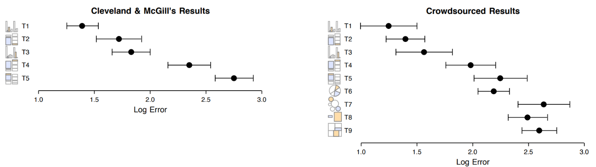
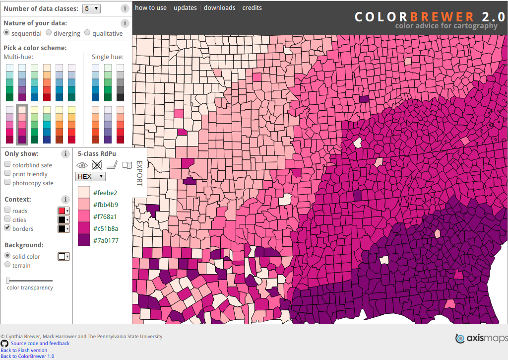

```{r setup, include=FALSE}
##------------------------------------------------------------------------------------------------------------
## Created by: Thomas Speidel
##------------------------------------------------------------------------------------------------------------

##------------------------------------------------------------------------------------------------------------
## Set common options
##------------------------------------------------------------------------------------------------------------
## Invalidate cache when the package version changes
options(htmltools.dir.version = FALSE)


## Global options
knitr::opts_chunk$set(echo = FALSE, 
                      warning = FALSE, 
                      message = FALSE, 
                      fig.path = 'Figures/', 
                      strip.white = TRUE, 
                      dpi = 144)


##------------------------------------------------------------------------------------------------------------
# Set pretty looking numbers
##------------------------------------------------------------------------------------------------------------
knitr::knit_hooks$set(inline = function(x) {
      if(is.numeric(x)){
          return(prettyNum(x, big.mark=","))
      }else{
          return(x)
       }
   })

##------------------------------------------------------------------------------------------------------------
# Allow font awesome icons
##------------------------------------------------------------------------------------------------------------
htmltools::tagList(rmarkdown::html_dependency_font_awesome())


##------------------------------------------------------------------------------------------------------------
## LOAD PACKAGES
##------------------------------------------------------------------------------------------------------------
library(lubridate)
library(dplyr)
library(readr)
library(readxl)
library(scales) 
library(viridis)
library(tidyr)
library(ggplot2)
library(extrafont)
library(viridis)
library(knitr)
library(Hmisc)
library(rms)
library(kableExtra)
library(forcats)
library(patchwork)
library(GGally)
library(htmltools)
library(ggmap)
library(lubridate)
library(htmlwidgets)
library(leaflet)

## Fonts
# font_import(pattern="[R/r]oboto")
# loadfonts(device="win")

```


class: inverse

# Agenda

<br>

1.   Visualizations: Objectives and Constraints

2.   Visualizations for Data Storytelling

3.   Univariate Visualizations

4.   Bivariate Visualizations

5.   Visualizing Models

6.   Tips & Best Practices

7.   What to Look for in Visualization Tools? An Opinionated List

8.   References

---

# Data Manifesto

Data, in an by themselves, do not directly create knowledge. While efforts to collect and store data have increased dramatically in recent years, nearly absent is a focus on knowledge creation.  In the age of **Big Data**, the availability of vast amounts of information can coexist with the **absence of knowledge**. 

**Data cannot speak for themselves**.  It is in when we interpret data that knowledge is created. My focus is on **bridging the gap between data and knowledge creation**. That gap is filled by statistics and evidence based decision making.

---

class: inverse, center, middle

# 1. Visualizations: Objectives and Constraints

---

# Why Visualizations?

> *At their best, graphics are instruments for reasoning about quantitative information (Tufte, 1983)*

> *Graphs are exceptionally powerful tools for data analysis (Cleveland, 1985)*

> *There is no statistical tool that is as powerful as a well-chosen graph (Chambers, 1983)*

> *Diagrams prove nothing, but bring outstanding features readily to the eye (Fisher, 1925)*


<br>

--

###Two broad objectives:

* **Communication**: display a convincing pattern, attract reader's attention (first goal)

* **Discovery**: observe deviations from our expectations (second goal)


<small>
.footnote[[1] *Gelman, Unwin. 2013 <a href="www.tandfonline.com/doi/abs/10.1080/10618600.2012.761137"> <i class="fa fa-external-link"></i></a>*]
</small>

---

# First Goal of Visualizations

To summarize, communicate and engage (telling a story)


---

# Second Goal of Visualizations

To identify, understand, highlight features or relationships (helping the readers make up their mind) 

<br>


<small>
.footnote[[1] *Gelman, Unwin. 2013 <a href="www.tandfonline.com/doi/abs/10.1080/10618600.2012.761137"> <i class="fa fa-external-link"></i></a>*]
</small>
---

# To Persuade or to Inform?

We **cannot** achieve both effectiviely at the same time!

<center>

--

.pull-left[
###To Persuade
 
]

--

.pull-right[
###To Inform
 
]

</center>

<small>
.footnote[[1] *Spiegelhalter, Pearson, Short. 2011 <a href="https://vcg.seas.harvard.edu/files/pfister/files/infovis_submission251-camera.pdf"> <i class="fa fa-external-link"></i></a>*] 
</small>

---

# To Remember or to Understand?

.pull-left[
Can we achieve memory **and** understanding at the same time?

1.  **Titles and annotations** help convey the message of a visualization 

2.  If used appropriately, **pictograms** do not interfere with understanding and can improve recognition

3.  **Redundancy** helps effectively communicate the message 
]


.pull-right[
<div style="text-align:center"></div>
</small>
]


<small>
.footnote[ [1] *Borkin et al. 2015. Beyond Memorability: Visualization Recognition and Recall <a href="https://vcg.seas.harvard.edu/files/pfister/files/infovis_submission251-camera.pdf"> <i class="fa fa-external-link"></i></a>*

[2] *Bob Rudis 2016. <a href="https://rud.is/b/2016/06/16/your-data-vis-spidey-sense-the-need-for-a-robust-utility-belt/"> <i class="fa fa-external-link"></i></a>*] 
</small>

---

# Example Dataset

The dataset originates from Doublet (2001).


<small>


```{r}
##------------------------------------------------------------------------------------------------------------
## DATA
##------------------------------------------------------------------------------------------------------------
blasingame <- read_excel("Data/Blasingame.xls", sheet = "Whole Core Data (nounits)")

var.names <- tolower(colnames(blasingame))
var.names <- make.names(var.names, unique = TRUE, allow_ = FALSE)
colnames(blasingame) <- var.names

blasingame <- blasingame %>%
     mutate(well = as.integer(well)) %>%
     mutate(rtype = as.factor(rtype)) %>%
     mutate(program = as.factor(program))

## Sample
# kable(blasingame[1:5, ])
kable(blasingame[1:5, ], "html", align = "l") %>% kable_styling(bootstrap_options = c("striped", "hover", "condensed"))

## Sample data
b.sample <- blasingame %>%
     select(well,
            depth,
            helium.porosity,
            kmax,
            rtype
            )

```

.footnote[ 
[1] *Thanks to D. Kaviani for pointing me to the data and for the preparatory work.*  
[2] *Doublet, L.E. (2001) An Integrated Geologic and Engineering Characterization of the North Robertson (Clear Fork) Unit, Gaines
County, Texas. Petroleum Engineering PhD thesis, Texas A&amp;M University.*
]

</small>

---
background-image: url(Figures/tukey.jpeg)
background-size: cover
class: inverse

<br><br><br><br><br><br><br><br><br><br>

# Exploratory Data Analysis (EDA)

As the analsys progresses we gradually build a more refined idea what we want to understand. Along this path we encounter many other **questions** that need answering, **problems** that need investigating and **ideas** that need exploring. You "*ask questions about whether your data meets your expectations or not*" (1). 

We call this **[exploratory data analysis](https://en.wikipedia.org/wiki/Exploratory_data_analysis)** (EDA).  EDA makes abundant use of statistical graphics.

>    *Graphs force us to note the unexpected; nothing could be more important.*  
<small>
>    -John Tukey 
</small>

<small>
.footnote[[1] *Grolemund, Wickham. R for Data Science, 2017 <a href="http://r4ds.had.co.nz/index.html"> <i class="fa fa-external-link"></i></a>*]
</small>


---

class: inverse, center, middle

# 2. Visualizations for Data Storytelling

---

# Telling a Story
.pull-left[

Display a convincing pattern, attract reader's attention
]

.pull-right[
<center>
<iframe width="470" height="405" src="Figures/booms.mp4" frameborder="0" allowfullscreen></iframe>
</center>
]

<small>
.footnote[[1] *Bob Rudis 2016<a href="https://rud.is/b/2016/03/26/nuclear-animations-in-r/"> <i class="fa fa-external-link"></i></a>*] 
</small>

---

background-image: url(Figures/nyt1.png)
background-size: cover

<small>
.footnote[[1] *New York Times. Mapping Poverty in America, 2014. <a href="http://www.nytimes.com/newsgraphics/2014/01/05/poverty-map/index.html/"> <i class="fa fa-external-link"></i></a>*] 
</small>

---

background-image: url(Figures/lupi3.jpg)
background-size: cover

<small>
.footnote[[1] *Giorgia Lupi. Nobels, No Degrees, 2012. <a href="https://www.behance.net/gallery/14159439/Nobel-no-degrees"> <i class="fa fa-external-link"></i></a>*] 
</small>

---

class: inverse, center, middle

# 3. Univariate Visualizations


---


# Summary Statistics

<small>

```{r, results='asis', fig.width=14, fig.height=2.25}
## Data
d <- b.sample %>% select(helium.porosity) %>% describe()
html(d, size=100, scroll=FALSE)
plot(d)

```

*Gmd stands for **Gini mean difference**, a scale independent measure of dispersion (it is the mean absolute difference between any pairs of observations).*

*Info is a measure of how continuous the variable is.*

</small>

---

# Alternative Univariate Visualizations


```{r, fig.width = 12, fig.height = 5}
p1 <- ggplot(b.sample, aes(helium.porosity)) +
     geom_histogram(color = "white") +
     theme_minimal(base_family = "Roboto Condensed") +
     labs(title = "Histogram",
          x = "Helium Porosity",
          y = "Count")

p2<- ggplot(b.sample, aes(helium.porosity)) +
     geom_density(fill = "grey40", color = "white") +
     theme_minimal(base_family = "Roboto Condensed") +
     labs(title = "Kernel Density",
          x = "",
          y = "Density")

p3 <- ggplot(b.sample, aes(x = "", y = helium.porosity)) +
     geom_boxplot(fill = "grey40", color = "grey60") +
     theme_minimal(base_family = "Roboto Condensed") +
     labs(title = "Box Plot",
          x = "",
          y = "Helium Porosity")

p4 <- ggplot(b.sample, aes(x = "", y = helium.porosity)) +
     geom_violin(fill = "grey40", color = "grey60") +
     theme_minimal(base_family = "Roboto Condensed") +
     labs(title = "Violin Plot",
          x = "",
          y = "Helium Porosity")


p5 <- ggplot(b.sample, aes(x = as.factor(well), y = helium.porosity)) +
     geom_jitter(width = 0.3, alpha = 0.7, color = "grey40", size = 0.7) +
     theme_minimal(base_family = "Roboto Condensed") +
     labs(title = "Scatter Plot with Jitter",
          x = "Well ID",
          y = "Helium Porosity") +
      guides(color = FALSE)


p6 <- ggplot(b.sample, aes(sample = helium.porosity)) +
     stat_qq() +
     theme_minimal(base_family = "Roboto Condensed") +
     labs(title = "QQ-Plot",
          x = "",
          y = "Helium Porosity")

p1 + p2 + p3 + p4 + p5 + p6

```


---

class: inverse, center, middle

# 4. Bivariate Visualizations

---

class: middle

>    *Numbers become evidence by being in relation to.*  
<small><small>
>    -Edward R. Tufte, Visual Explanations: Images & Quantities, Evidence & Narrative (1997)
</small></small>

---

# Tables

<small>
<small>
<small>

```{r, results='markup'}
## Data
options(grType='ggplot') # for certain graphics functions
mu <- markupSpecs$html   # markupSpecs is in Hmisc
cap  <- mu$cap           # function to output html caption
lcap <- mu$lcap          # for continuation for long caption

s <- summaryM(depth + helium.porosity + gdens + kmax ~ rtype, 
              data=blasingame,
              overall=TRUE, 
              test=TRUE)

html(s, caption='Baseline characteristics by rock type',
     exclude1=TRUE, 
     npct='both', 
     digits=2,
     prmsd=TRUE, 
     brmsd=TRUE, 
     msdsize=mu$smaller3)

```

</small>
</small>
</small>

---

# Combining Tables with Graphs
<br>

<center>

</center>

<small>
.footnote[
[1] *Matthew Leonawicz <a href="https://leonawicz.github.io/HtmlWidgetExamples/ex_dt_sparkline.html"> <i class="fa fa-external-link"></i></a>*]
</small>


---
# Kernel Density

Kernel density plots have the unique advantage that they are self-standardizing. They are also more effective than histograms. This makes them useful to **compare distributions** when the units aren't the same (not here).


```{r, results='markup', fig.height = 2.5, fig.width = 7, dev="png"}
ggplot(b.sample, aes(helium.porosity)) +
     geom_density(alpha = 0.6, fill = "grey40", color = "white") +
     scale_fill_viridis(option="viridis", discrete = TRUE) +
     xlab("Helium Porosity") +
     ylab("Density") +
     theme_minimal(base_family = "Roboto Condensed") +
     facet_grid(~rtype)

```

---
# Scatterplot Matrix or Cross Plot
One of the very first plots you ant to make. Shows all pairwise combinations. Here, I've cheated by removing a few outliers.


```{r, results='markup', fig.align="cenwter", fig.height = 6, fig.width = 15, out.width="1200px", out.height="450px", dev="png"}
blasingame <- blasingame %>%
     filter(kmax < 100) %>%
     filter(gdens > 0.5) %>%
     as.data.frame() %>%
     mutate(well = as.factor(well))

## May require dev version of ggpairs
ggpairs(data   = blasingame,
        columns= c(2,4:7),
        upper  = list(continuous = "density"),
        lower  = list(combo = "facetdensity"),
        ggplot2::aes(colour=rtype, alpha = 0.1)) +
     theme_minimal(base_family = "Roboto Condensed") +
     theme(axis.text.x = element_text(size = 10, family = "Roboto Condensed")) +
     theme(axis.text.y = element_text(size = 10, family = "Roboto Condensed")) +
     theme(strip.text.x = element_text(size = 18)) +
     theme(strip.text.y = element_text(size = 18))


```


---
# Boxplots
Here we *cut* (bin) `helium.porosity` into quartiles (P25, P50, P75). 


```{r, results='markup', fig.height = 3.2, fig.width = 7, cache = TRUE}
g1 <- 
     ggplot(blasingame, aes(cut2(helium.porosity, g = 4), k90)) + 
     geom_boxplot(outlier.alpha = 0.6, fill = "grey70",  lwd = 0.2) + 
     scale_fill_viridis(option="viridis", discrete = TRUE) +
     theme_minimal(base_family = "Roboto Condensed") +
     labs(x = "\nHelium Porosity")

g2 <- 
     ggplot(blasingame, aes(cut2(helium.porosity, g = 4), k90)) + 
     geom_boxplot(outlier.alpha = 0.6, fill = "grey70", lwd = 0.2) + 
     scale_fill_viridis(option="viridis", discrete = TRUE) +
     theme_minimal(base_family = "Roboto Condensed") +
     scale_y_log10() +
     annotation_logticks(sides = "l") +
     labs(y = "log(k90)", x = "\nHelium Porosity")

g1 + g2

```

---
# Scatterplots With 2 Variables

```{r, results='markup', fig.align="center", fig.height = 6, fig.width = 15, out.width="1200px", out.height="450px", dev="png"}
ggplot(blasingame, aes(x = helium.porosity, y = k90)) +
     geom_point(alpha = 0.5, shape = 19) +
     scale_y_log10() +
     scale_x_log10() +     
     scale_color_viridis(option="viridis", discrete = TRUE) +
     theme_minimal(base_family = "Roboto Condensed")

```


---
# Scatterplots With 3 Variables

```{r, results='markup', fig.height = 4.4, fig.width = 9, dev = "png"}
ggplot(blasingame, aes(x = helium.porosity, y = k90, color = rtype)) +
     geom_point(alpha = 0.5, shape = 19) +
     scale_y_log10() +
     scale_x_log10() +     
     scale_color_viridis(option="viridis", discrete = TRUE) +
     theme_minimal(base_family = "Roboto Condensed")

```

---
# Scatterplots With 4 Variables

```{r, results='markup', fig.height = 4.4, fig.width = 9, dev = "png"}
ggplot(blasingame, aes(x = helium.porosity, y = k90, color = rtype, size = depth)) +
     geom_point(alpha = 0.5, shape = 19) +
     scale_size_continuous(range = c(0.2, 2.4)) +
     scale_y_log10() +
     scale_x_log10() +     
     scale_color_viridis(option="viridis", discrete = TRUE) +
     theme_minimal(base_family = "Roboto Condensed")

```


---

# Correlation Matrix
A unitless measure of the strength of the association between pairs of variables.

```{r, results='markup', fig.align="center", fig.height = 6, fig.width = 15, out.width="1200px", out.height="450px", dev="png"}
blasingame <- blasingame %>%
     filter(rtype !=7) %>%
     mutate(rtype = droplevels(rtype)) %>%
     mutate(kmax.log = log2(kmax)) %>%
     mutate(k.ratio = kmax/k90) %>%
     mutate(k.ratio.log = log2(k.ratio)) %>%
     filter(kmax < 100)

blasingame.clus <- blasingame %>%
     select(-well, -kmax.log, -k.ratio, -k.ratio.log, -program, -rtype) %>%
     na.delete()

ggcorr(blasingame.clus,
       method = c("pairwise", "spearman"),
       geom = "blank", 
       label = TRUE, 
       layout.exp = 4,
       label_size = 4.5,
       hjust = 0.75,
       size = 4.5,
       family = "Roboto Condensed") +
     geom_point(size = 10, aes(color = coefficient > 0, alpha = abs(coefficient) > 0.5)) +
     scale_alpha_manual(values = c("TRUE" = 0.25, "FALSE" = 0)) +
     guides(color = FALSE, alpha = FALSE) 


```


---

class: inverse, center, middle

# 5. Visualizing Models

---


# Graphs for Models
It's much easier to interpret a model by graphing it! Here's a regression model of `k.ratio` on several variables. Compare this:

<small><small><small>
.pull-left[

```{r, results='markup', fig.height=5.5, fig.width=14, dev = "png"}
dd <- datadist (blasingame); options(datadist = 'dd')
f1 <- orm(k.ratio ~  rcs(helium.porosity, 4) + rcs(pe, 3) + nphils + rtype, 
         family = "logistic",
         data = blasingame,
         scale = TRUE,
         tol = 1e-20,
         x = TRUE,
         y = TRUE)

an <- anova(f1)
bar <- Mean(f1)
qu <- Quantile(f1)
p50 <- function(x) qu(0.50, x)
p25 <- function(x) qu(0.25, x)
p75 <- function(x) qu(0.75, x)

options(prType='html')
# print(f1, digits=3, long=FALSE, table = FALSE, conf.int=TRUE)
print(summary(f1))

```

]
</small></small></small>

---

... with this:

<br>

<center>

```{r, results='markup', fig.align="center", fig.height = 6, fig.width = 15}
ggplot(rms::Predict(f1, fun = bar),
       anova = an, 
       pval = TRUE,
       layout = c(1, 5),
       colfill = "gray50",
       adj.subtitle = TRUE,
       addlayer =           
          theme_minimal(base_size = 14, base_family = "Roboto Condensed") +
         labs(y = "Predicted k.ratio")
       )
```

</center>

---

... or this:

<br>

<center>

```{r, results='markup', fig.height=6.5, fig.width=10, out.width="700px", out.height="400px",  dev = "png", fig.cap = "<small><small>Non-linear regression model showing the simultaneous effect, on the dependent variable permeability ratio (Kmax/k90), of changing two continuous variables (helium porosity and photoelectric capture cross-section log) while holding (marginalizing) all other variables fixed at their median.</small></small>"}
p <- rms::Predict(f1, helium.porosity, pe, rtype, np = 100, fun = p50)

par(family = 'Roboto Condensed')
trellis.par.set(list(axis.text = list(fontfamily = "Roboto Condensed", cex = 0.9), par.strip.text = list(fontfamily = "Roboto Condensed")))

bplot(p,
      xlab = "Helium Porosity (total porosity)",
      ylab = "Photoelectric Capture\nCross-section\n(barns/electron)",
      family = 'Roboto Condensed',
      adj.subtitle = FALSE,
      layout = c(3, 2),
      scales = list(tck = c(1,0),
                    x = list(cex = 1, fontfamily = "Roboto Condensed"),
                    y = list(cex = 1, fontfamily = "Roboto Condensed")),
      par.settings = list(fontsize = list(text = 12, family = "Roboto Condensed"),
                          grid.pars = list(fontfamily = "Roboto Condensed"),
                          strip.background = list(col = "gray85"),
                          layout.heights = list(strip = 1.6),
                          axis.line = list(col = "white"),
                          strip.border = list(col = "white"),
                          layout.widths = list(ylab.axis.padding = 0, xlab.axis.padding = 0)
                          ),
      par.strip.text=list(cex = 1, fontfamily = "Roboto Condensed"),
      col="white",
      col.regions = c("#482576FF",
                      "#453581FF",
                      "#404688FF",
                      "#3A548CFF",
                      "#33638DFF",
                      "#2D718EFF",
                      "#287D8EFF",
                      "#238A8DFF",
                      "#1F968BFF",
                      "#20A386FF",
                      "#29AF7FFF",
                      "#3DBC74FF",
                      "#57C766FF",
                      "#75D054FF",
                      "#98D83EFF",
                      "#BBDF27FF")
      )


```

</center>

---

background-image: url(Figures/malaysia.gif)
background-size: cover

<small>
.footnote[[1] *New York Times. How Missing Jet’s Debris Could Have Floated to Réunion, 2015. <a href="https://www.nytimes.com/interactive/2014/03/17/world/asia/search-for-flight-370.html"> <i class="fa fa-external-link"></i></a>*] 
</small>

---

# Visualizing Principal Components
Principal components allow us to describe our data with fewer new variables. These new variables are linear combinations of multiple variables. We call these new variables principal components.


```{r, results='markup'}
blasingame <- mutate(blasingame, well = as.factor(well))

## Use Sparse PC
library(ggbiplot)
(pc <- prcomp(select(blasingame, gr, rhob, pe, nphils, lld, lls), scale. = TRUE, center = TRUE))
```

---

# Visualizing Principal Components

```{r, results='markup', fig.align="center", fig.height = 8, fig.width = 15}
ggbiplot(pc, 
         obs.scale = 1, 
         var.scale = 1,
         ellipse = TRUE, 
         circle = FALSE,
         alpha = 0,
         varname.size = 4.5, 
         labels.size = 6) +
  geom_point(aes(colour =  blasingame$rtype), size = 2.6, alpha = 0.5) +
  # geom_text(aes(label = rownames(hunt)), hjust = 0, vjust = 0, size = 4) +  
  scale_color_viridis_d(direction = -1) +
  labs(colour = "Rock Type") +
  theme_minimal(base_family = "Raleway", base_size = 14) + 
  theme(legend.position="right") + 
  theme(panel.background = element_rect(fill = "#FCFCFC", colour = NA), plot.background = element_rect(fill = "#FCFCFC", colour = NA)) +
  geom_vline(xintercept = 0, color = "grey10", size = 0.2) +
  geom_hline(yintercept = 0, color = "grey10", size = 0.2)

```

---

# Visualizing CART Models
CART stands for **Classification and Regression Trees** a non-parametric type of model. Hypothetically, let's fit a model to predict rock type using `depth` and `helium.porosity` and visualize the results:

```{r, results='markup', fig.align="center", fig.height = 6.5, fig.width = 14.5}
library(partykit)
rocks <- ctree(rtype ~ depth + helium.porosity + k90, data = blasingame)
plot(rocks, gp = gpar(fontfamily = 'Roboto Condensed'))

```

---

# Visually Comparing Multiple Models

```{r, results='markup', fig.align="center", fig.height = 6, fig.width = 8, out.width="600px", out.height="500px", cache = TRUE}
library(caret)
library(doMC)
doMC::registerDoMC(cores = 6)

train_log <- createDataPartition(blasingame$rtype, times = 1, p=0.75, list=F)
preProc <-c("BoxCox", "center","scale")
tctrl <- trainControl(method = "repeatedcv", 
                      number=10, 
                      repeats=10)

f <- rtype ~ depth + helium.porosity + gdens + kmax + gr + rhob + lld

set.seed(321)
rpart_model <- train(f, blasingame, method="rpart",
               preProcess = preProc,
               metric = "Kappa",
               trControl = tctrl,
               subset = train_log)
 
set.seed(321)
rf_model <- train(f, blasingame, method="rf",
                     preProcess = preProc,
                     metric = "Kappa",
                     trControl = tctrl,
                     subset = train_log)

set.seed(321)
gbmFit1 <- train(f, blasingame, 
                 preProcess = preProc,
                 method = "gbm", 
                 trControl = tctrl,
                 verbose = FALSE)

set.seed(321)
rmdaFit1 <- train(f, blasingame, 
                 preProcess = preProc,
                 method = "pda", 
                 trControl = tctrl,
                 verbose = FALSE)

set.seed(321)
svm <- train(f, blasingame, 
                 preProcess = preProc,
                 method = "svmRadial", 
                 trControl = tctrl,
                 verbose = FALSE)

allResamples <- resamples(list("SVM" = svm, "CART" = rpart_model, "Random Forest" = rf_model, "Gradient Boosting" = gbmFit1, "Penalized Discriminant Analysis" = rmdaFit1))
parallelplot(allResamples)

```

---

# Diagrams to Explain
.pull-left[

While not showing a model per-se, diagrams can help make unintuitive topics more transparent. Here, because of the low prevalence of drug consumption, we observe a high **false positive rate** (test says a person has consumed a drug, but in truth s/he has not), despite high test accuracy. 
]

.pull-right[

]

<small>
.footnote[[1] *Spiegelhalter et al. Visualizing Uncertainty About the Future. 2011 <a href="http://science.sciencemag.org/content/333/6048/1393"> <i class="fa fa-external-link"></i></a>*]
</small>


---
class: inverse, center, middle

# 6. Tips & Best Practices

---

class: middle

>    *Information displays should be documentary, comparative, causal and explanatory, quantified, multivariate, exploratory, skeptical.*  
<small><small>
>    -Edward R. Tufte, Visual Explanations: Images & Quantities, Evidence & Narrative (1997)
</small></small>

---


# General Graphing

```{r, results='markup', fig.height = 4.4, fig.width = 9, dev = "png", eval=FALSE}
ggplot(blasingame, aes(x = helium.porosity, y = k90)) +
     geom_point(aes(color = rtype, size = depth), alpha = 0.5, shape = 19) +
     geom_smooth(size = 0.5, color = "grey40", alpha = 0.25, method = "loess") +
     scale_size_continuous(range = c(0.4, 3)) +
     scale_y_log10() +
     scale_x_log10() +     
     scale_color_viridis(option="viridis", discrete = TRUE) +
     theme_minimal(base_family = "Roboto Condensed")

```
<center>

</center>

---

# Table Tips

<center>

</center>

<small>
.footnote[[1] *Recreated from Ehrenberg, 1981 <a href="https://www.stat.washington.edu/pds/stat423/Documents/Ehrenberg.numeracy.pdf"> <i class="fa fa-external-link"></i></a>*]
</small>


---

# Use (and abuse) Smoothers

```{r}
# ## Via David Robinson http://varianceexplained.org/files/loess.html
# library(lattice)
# library(broom)
# library(gganimate)
# 
# theme_set(theme_bw(base_family = "Roboto Condensed", base_size = 15))
# 
# mod <- loess(NOx ~ E, ethanol, degree = 1, span = .75)
# fit <- augment(mod)
# dat <- ethanol %>%
#   inflate(center = unique(ethanol$E)) %>%
#   mutate(dist = abs(E - center)) %>%
#   filter(rank(dist) / n() <= .75) %>%
#   mutate(weight = (1 - (dist / max(dist)) ^ 3) ^ 3)
# 
# spans <- c(.25, .5, .75, 1)
# 
# # create loess fits, one for each span
# fits <- data_frame(span = spans) %>%
#   group_by(span) %>%
#   do(augment(loess(NOx ~ E, ethanol, degree = 1, span = .$span)))
# 
# # calculate weights to reproduce this with local weighted fits
# dat <- ethanol %>%
#   inflate(span = spans, center = unique(ethanol$E)) %>%
#   mutate(dist = abs(E - center)) %>%
#   filter(rank(dist) / n() <= span) %>%
#   mutate(weight = (1 - (dist / max(dist)) ^ 3) ^ 3)
# 
# # create faceted plot with changing points, local linear fits, and vertical lines,
# # and constant hollow points and loess fit
# p <- ggplot(dat, aes(E, NOx)) +
#   geom_point(aes(alpha = weight, frame = center)) +
#   geom_smooth(aes(group = center, frame = center, weight = weight), method = "lm", se = FALSE) +
#   geom_vline(aes(xintercept = center, frame = center), lty = 2) +
#   geom_point(shape = 1, data = ethanol, alpha = .25) +
#   geom_line(aes(y = .fitted, frame = E, cumulative = TRUE), data = fits, color = "red") +
#   facet_wrap(~span) +
#   ylim(0, 5) +
#   ggtitle("x0 = ") +
#   theme_light(base_family = "Roboto Condensed", base_size = 26)
# 
# 
# library(animation)
# animation::ani.options(ani.width = 1400, ani.height = 900, ani.res = 300)
# gganimate(p, filename = "loess.mp4", interval=0.2)


g <- ggplot(blasingame, aes(helium.porosity, kmax)) + 
  scale_y_log10() +
  scale_x_log10() +
  geom_point(alpha = 0.2, size = 4) +
  geom_smooth(color = "firebrick")  +
  theme_minimal(base_family = "Roboto Condensed", base_size = 28)

ggsave("Figures/loess.svg", width = 12, height = 6)

```

.pull-left[
Smoothers are incredibly useful in order to highlight possible **trends** in the data. One of the most popular and flexible smoother is Cleveland's [**LOESS**](https://en.wikipedia.org/wiki/Local_regression) (locally weighted least squares method).

<small>

* Non-linear
* Built-in outlier control
* Can control degree of smoothness
* Works well even when one of the variables is binary

</small>


]

.pull-right[

<iframe width="492" height="316" src="loess.mp4" frameborder="0" allowfullscreen></iframe> 

]


---

# Data-to-Ink Ratio

.pull-left[
###Chartjunk
All visual elements in charts and graphs that are not necessary to comprehend the information represented on the graph, or that distract the viewer from this information. Instead, we want to achieve **rapid visual perception**. <small>(Tufte, 1983, 2006)</small> 


]

.pull-right[
###Data-to-ink ratio
Of all the ink used in a graph, the amount of ink that **transports information**.  We want this to be high. <small>(Tufte, 1983, 2006)</small>

<br><br>
]

---
###Data-to-ink ratio

<br>


<small>
.footnote[[1] *Recreated from Tufte, 1983. Visual Explanations: Images and Quantities, Evidence and Narrative <a href="https://www.stat.washington.edu/pds/stat423/Documents/Ehrenberg.numeracy.pdf"> <i class="fa fa-external-link"></i></a>*]
</small>

---

# Avoid Pies
.pull-left[
### Why
Plenty of scientific evidence shows that humans are **bad at judging size and making comparisons from angles**. Pie charts do not facilitate comparison when slices are close in size nor can one sort numbers.


]
.pull-right[
### Exceptions
Ok to use when there are few well distinct slices to represent. Because we are only good at judging slices that are ½ or ¼ of the total, we should aim to have **2-4 slices** at most.

Avoid the **doughnut types**: they remove the angular information we need to draw visual comparisons.

### Alternatives
Use bar charts or dot plots.

]

---
# The Type of Chart Affects Visual Judgement
Experiments performed to quantify visual judgment of graphs: 25 years later, results have not changed.

<br>

<center>

</center>


<small>
.footnote[
[1] *Cleveland and McGill, 1984 <a href="http://info.slis.indiana.edu/~katy/S637-S11/cleveland84.pdf"> <i class="fa fa-external-link"></i></a> and Heer and Bostok, 2010 <a href="http://vis.stanford.edu/files/2010-MTurk-CHI.pdf"> <i class="fa fa-external-link"></i></a>*
]
</small>


---

# Avoid 3D
.pull-left[
### Why
Removes clarity, adds obfuscation, inhibits comprehension, does not help retain information, third dimension is usually inexistent (and if it did exist, you would try to avoid it).

### Exceptions
Spatial data, interaction surfaces.

### Advantages
A reader is more likely to remember a 3D graph than a plain graph.
]

.pull-right[
### Disadvantage
A reader is more likely to be confused by a 3D graph than a plain graph.


]

---
# Visualizing High Density Data

### Good...
Add **transparency** (alpha). Easy and quick to implement: reveals underlying patterns but hides outliers and sparse data points.

```{r, results='markup', fig.height = 3, fig.width = 11, out.width="980px", out.height="250px"}
set.seed(123)
n = 10000
age <- rnorm(n, 30, 10) 
value <- rnorm(n, 200, 25) 
level <- factor(sample(c('high','low'), n, TRUE)) 
metric <- 0.4*(level == 'low') + .045*(age-20) + (log(value - 10)-5.2)*(-2*(level == 'high') + 2*(value == 'low')) 
df <- data.frame(age, value, level, metric)

p0 <- ggplot(df, aes(value, metric, color = level)) + 
  geom_point() +
  scale_color_viridis_d() +
  labs(title = "No Transparency") +
  theme_minimal(base_family = "Roboto Condensed", base_size = 10) +
  theme(title = element_text(size = 12)) +
  theme(legend.position = "none")


p1 <- ggplot(df, aes(value, metric, color = level)) + 
  geom_point(alpha = 0.8) +
  scale_color_viridis_d() +
  labs(title = "Transparency=0.8") +
  theme_minimal(base_family = "Roboto Condensed", base_size = 10)+
  theme(title = element_text(size = 12)) +
  theme(legend.position = "none")


p3 <- ggplot(df, aes(value, metric, color = level)) + 
  geom_point(alpha = 0.4) +
  scale_color_viridis_d() +
  labs(title = "Transparency=0.4") +
  theme_minimal(base_family = "Roboto Condensed", base_size = 10)+
  theme(title = element_text(size = 12)) +
  theme(legend.position = "none")


p5 <- ggplot(df, aes(value, metric, color = level)) + 
  geom_point(alpha = 0.05) +
  scale_color_viridis_d() +
  labs(title = "Transparency=0.05") +
  theme_minimal(base_family = "Roboto Condensed", base_size = 10)+
  theme(title = element_text(size = 12)) +
  theme(legend.position = "none")


p0+p1+p3+p5 + plot_layout(ncol = 4)

```

---

# Visualizing High Density Data

### Better...
Use **binning techniques** for high density data (they've been around since the mid 80's!). A little harder to read, but won't miss outliers and sparse data.


```{r, results='markup', fig.height = 4, fig.width = 11, out.width="980px", out.height="350px"}
g1<- ggplot(df, aes(value, metric, color = level)) + 
  stat_binhex(alpha = 0.8) +
  scale_fill_viridis_c() +
  labs(title = "Hexagonal Binning") +
  theme_minimal(base_family = "Roboto Condensed", base_size = 10)+
  theme(title = element_text(size = 12))

p0+g1
```

---

# Visualizing High Density Data

### Best...
**Critically assess** whether you need BIG data in the first place: unless outliers are the main focus of analysis, it's often satisfactory to **sample** the data.

```{r, results='markup', fig.height = 2.5, fig.width = 2.8, out.width="300px", out.height="280px"}
set.seed(123)
ggplot(sample_n(df, 400), aes(value, metric, color = level)) + 
  geom_point(alpha = 0.8) +
  scale_color_viridis_d() +
  labs(title = "Random Sample") +
  theme_minimal(base_family = "Roboto Condensed", base_size = 10) +
  theme(title = element_text(size = 12)) +
  theme(legend.position = "none")

```


<small>
.footnote[
[1] *If you are unconvinced, ask yourself: do I really have the whole population despite a huge dataset? Big data provides no protection against bias <a href="https://www.e-publications.org/ims/submission/AOAS/user/submissionFile/34436?confirm=7e3fbb22"> <i class="fa fa-external-link"></i></a>*
]
</small>

---

# Visualizing Changes Over Time

.pull-left[

]

.pull-right[
* Works well when the data is not huge. 
* Best if stratified.
* x-axis needs not be time, but best if ordinal.
]

<small>
.footnote[
[1] *Harrell, 2017 <a href="http://www.fharrell.com/doc/bbr.pdf"> <i class="fa fa-external-link"></i></a>*
]
</small>
---


# Choosing Appropriate Color
Choice of color is often subject to "*misguided artistry*". There are numerous empirically validated color scales, so the analyst's job is made significantly easier. 
.pull-left[

]


.pull-right[

<br>
<small><small>
*...finally, we confirmed that a rainbow colormap (jet) does indeed perform the worst overall in terms of both time and error, and should be jettisoned.*
</small></small>
]


<small><small>
.footnote[
[1] *Brewer. Colorbrewer 2.0: Color Advice for Cartography <a href="http://colorbrewer2.org/"> <i class="fa fa-external-link"></i></a>*  
[2] *Liu, Heer. Somewhere Over the Rainbow: An Empirical Assessment of Quantitative Colormaps. 2018 <a href="https://idl.cs.washington.edu/files/2018-QuantitativeColor-CHI.pdf"> <i class="fa fa-external-link"></i></a>*
</small></small>
]

---

# Show the Uncertainty
We need to visualize the uncertainty in order to make optimal decisions.

.pull-left[
<br>

]

.pull-right[

]


<small>
.footnote[
[1] *New York Times. How Not to Be Misled by the Jobs Report, 2014 <a href="https://www.nytimes.com/2014/05/02/upshot/how-not-to-be-misled-by-the-jobs-report.html"> <i class="fa fa-external-link"></i></a>*  
[2] *Chato Osio and Hamon. 2017 <a href="http://www.flr-project.org/doc/ggplotFL_plotting_FLR_objects_with_ggplot2.html"> <i class="fa fa-external-link"></i></a>*

]
</small>

---
class: center, middle


---
# Small Multiples

A series of very similar graphs where the eye is drawn on comparing differences among them.


<small>
*(1) Source <a href="http://thedailyviz.com/2016/12/14/four-decades-of-state-unemployment-rates-in-small-multiples-part-2/"> <i class="fa fa-external-link"></i></a>*
</small>


---
# Should We Anthropomorphize Visualizations?

*...to attribute human form or personality to things not human*

<br>

.pull-left[
In 2017, Boy et al. (1) conducted visual experiments on 284 particpants. They found no evidence that anthropomorphizing visualizations has benefits on empathy.
]

.pull-right[

]

<br><br>

<small>
*(1) Boy J. et al. Showing People Behind Data: Does Anthropomorphizing Visualizations Elicit More Empathy for Human Rights Data?* <a href="https://dl.acm.org/citation.cfm?doid=3025453.3025512"> <i class="fa fa-external-link"></i></a>
</small>

---

class: inverse, center, middle

# 7. What to Look for in Visualization Tools? An Opinionated List

---

# What to Look for in Visualization Tools? An Opinionated List

Goal 1: *to identify, highlight features or relationships*  
Goal 2: *to summarize, communicate and engage (telling a story)*


<small><small>

| Evaluation Item                       	| Notes                                                                                                                                       	|
|---------------------------------------	|---------------------------------------------------------------------------------------------------------------------------------------------	|
| Who is it for?                        	| Identify the users and consumers. Likely 2-3 streams.                                                                                       	|
| Goal 1 or goal 2?                     	| Data visualization vs. visual storytelling                                                                                                  	|
| No one size fits all                  	| General purpose vs. special purpose                                                                                                         	|
| Data preparation approach             	| Visual composition framework                                                                                                                	|
| Data preparation capabilities         	| Joins, filter, aggregate, sample, rank, reshape, append, grouping, text extraction, logical operators, mathematical expressions             	|
| Handling of dates and times           	| Human readable and adherence to ISO standards.                                                                                              	|
| Time series data preparation          	| Rolling windows, date padding, durations, rolling statistics, smart aggregations                                                            	|
| Breadth of statistics for aggregation 	| Mean, percentiles, ranks, min/max, counts, totals, conditional statistics, proportions, duration, harmonic mean, geometric mean, sd, IQR... 	|
| Missing values                        	| Appropriate handling/warning of missing data                                                                                                	|
| Ability to show uncertainty           	| Confidence bands, error bars, rangeplots                                                                                                    	|
| General purpose smoothers             	| LOESS, exponential smoothing                                                                                                                	|
| Quality of visualizations             	| Avoids or encourage chartjunk                                                                                                               	|
| Breadth of visualizations             	| Standard graphs and modern graphs (e.g. ridgeline plots, violin plots, circular migration plots, word clouds)                               	|                             	|                                                     	|

</small></small>

---
# What to Look for in Visualization Tools? An Opinionated List

<small><small>

| Evaluation Item 	| Notes                                                                                     	|
|-----------------	|-------------------------------------------------------------------------------------------	|
| Learning curve  	| Effort and time                                                                           	|
| Community size  	| Extremely important! Forum, discussion boards, conferences, books, blogs, YouTube, MOOC's 	|
| Extensibility   	| Community contribute added features                                                       	|
| Extensibility   	| Play nice with R, Python?                                                                 	|
| Connectivity    	| Beyond common connections. E.g. API's Bloomberg, weather, social media                    	|

</small></small>

Don't over-rely on IT advisory and consulting firms.

When evaluating tools, **weighting** and **scoring** tend to be arbitrary and subjective. Scales are also arbitrary with little scientific basis. This usually results in poor choices. Weights are easy to manipulate in order to favour one tool over another. The resulting scoring matrices can be "*worse than useless, leading to worse-than-random decisions*"(1).

Favour a **thorough qualitative evaluation**, ideally from a **pilot** rather than a pseudo-scientific scoring matrix. 


<small>
.footnote[[1] *Cox LA Jr. What's wrong with risk matrices? Risk Anal. 2008 Apr <a href="https://www.ncbi.nlm.nih.gov/pubmed/18419665"> <i class="fa fa-external-link"></i></a>*] 
</small>
---

# What to Look for in Visualization Tools? An Opnionated List
Remember Tufte: *Numbers become evidence by being in relation to*. Does the tool encourage comparisons? Does it make it easy? A simple test is to plot a stratified box-plot.

```{r, results='markup', fig.height=5, fig.width=10}
ggplot(mpg, aes(class, hwy)) +
  geom_boxplot(fill = "grey90") +
  theme_minimal(base_family = "Roboto Condensed")

```


---

class: middle

>    *An approximate answer to the right problem is worth a good deal more than an exact answer to an approximate problem*  
<small><small>
>    -John Tukey
</small></small>

---

class: inverse, center, middle

# 8. References

---

class: center, middle


---

class: center, middle

<small>

| Author                                    	| Title                                	|
|---------------------------------------	|-------------------------------------------------------------------------------	|
| Tufte, E. R. (1983)                   	| The Visual Display Of Quantitative Information                                	|
| Tufte, E. R. (1990)                   	| Envisioning Information                                                       	|
| Tukey, J. W. (1977)                   	| Exploratory Data Analysis                                                     	|
| Few, S. (2012)                        	| Show Me The Numbers. Designing Tables And Graph To Enlighten.                 	|
| Chiasson T., Gregory D. et al. (2014) 	| Data + Design                                                                 	|
| Ehrenberg, A.S.C. (1981)              	| The Problem Of Numeracy. The American Statistician, Vol. 35, N. 2             	|
| Wilkinson, L. (2005)                  	| The Grammar Of Graphics                                                       	|
| Simon, H.A. (1996)                    	| The Sciences Of The Artificial.                                               	|
| Cleveland, W.S. (1985)                	| The Elements Of Graphing Data.                                                	|
| Yau, N. (2011)                        	| Visualize This. The Flowingdata Guide To Design, Visualization And Statistics 	|
| Good P.I., Hardin J.W. (2012)         	| Common Errors In Statistics (And How To Avoid Them)                           	|
| Gelman A., Unwin A. (2012)            	| Infovis And Statistical Graphics: Different Goals, Different Looks            	|

</small>

---
background-image: url(Figures/background2.jpg)
background-size: cover
class: inverse, center, middle

# Thank you

**Thomas Speidel**  
thomas@speidel.ca <a href="mailto:thomas@speidel.ca"> <i class="fa fa-external-link"></i></a>   
ca.linkedin.com/in/speidel/ <a href="http://ca.linkedin.com/in/speidel"> <i class="fa fa-external-link"></i></a>   
alternative-stats.netlify.com <a href="http://alternative-stats.netlify.com"> <i class="fa fa-external-link"></i></a>   

<br>
<small><small>

*This presentation and most of the graphs were produced in [**R**](https://en.wikipedia.org/wiki/R_(programming_language)), a programming language and software <br> environment for statistical computing and graphics. The [Xaringan](https://slides.yihui.name/xaringan/#1) package was used for the presentation.*


</small></small>


