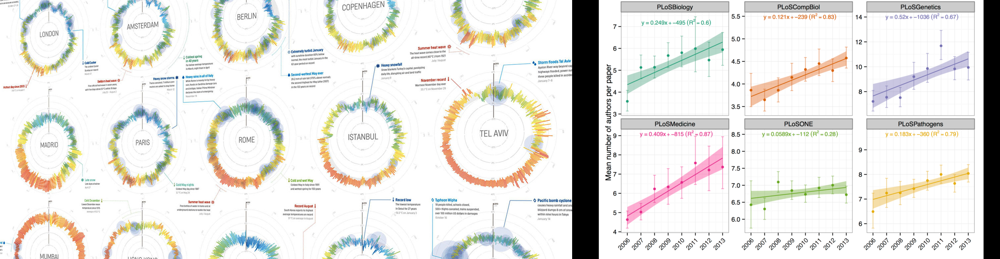
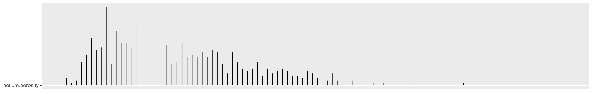
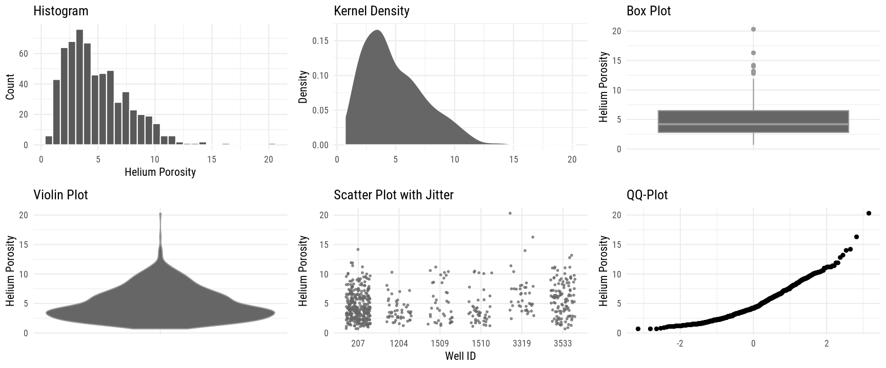
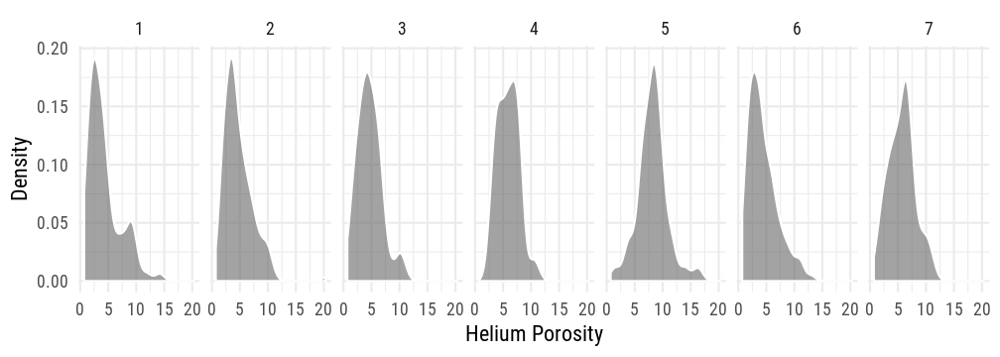
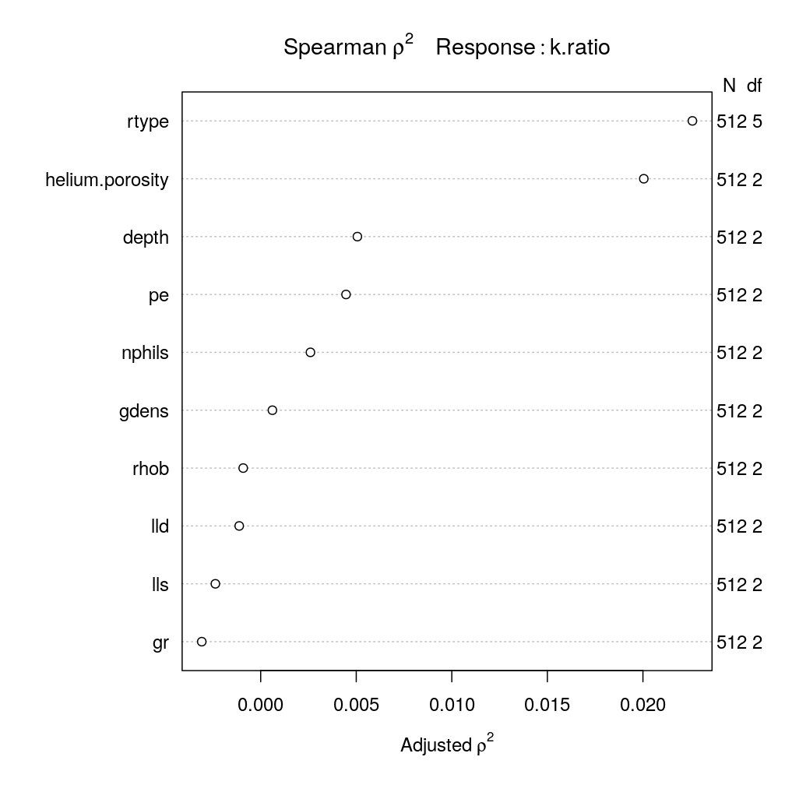
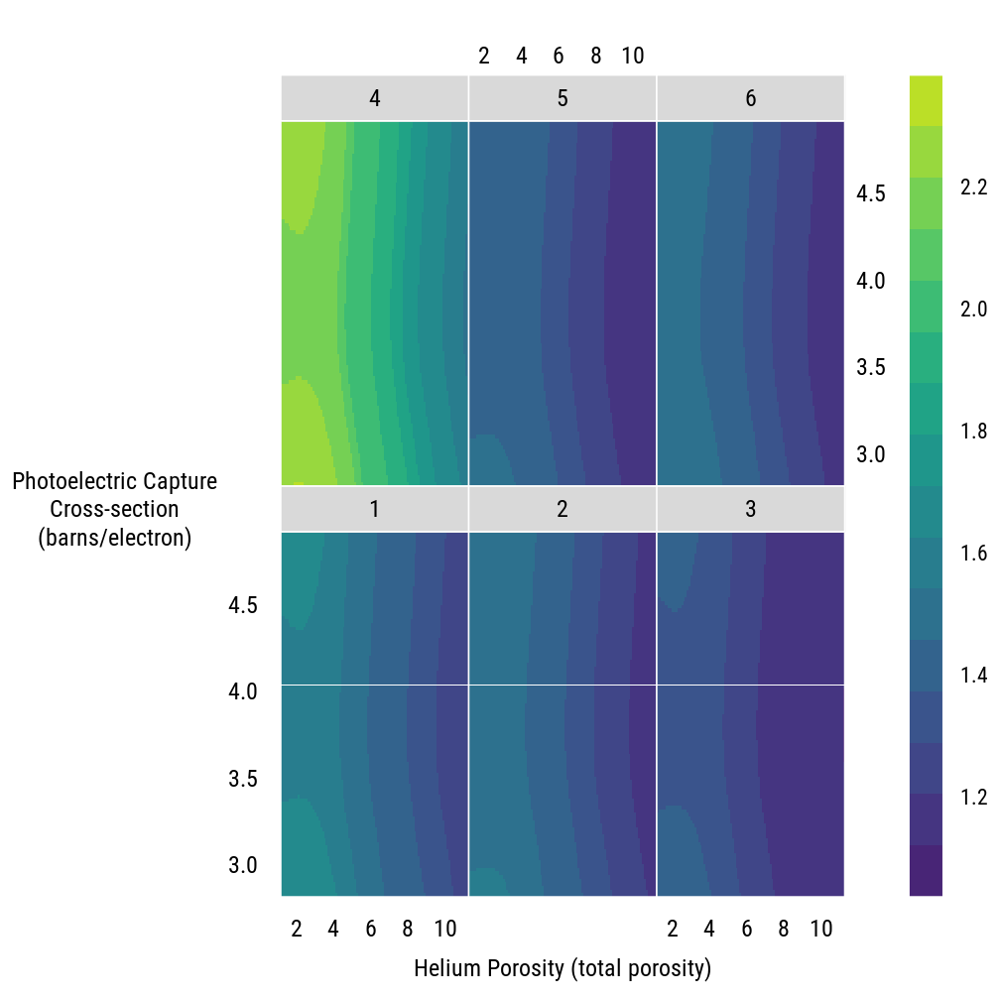

Visualizations in the Analysis Workflow
========================================================
author: Thomas Speidel, P.Stat., Data Scientist, Suncor Energy
date: January 2017
autosize: true
font-family: 'Roboto Condensed'
css: Speidel.css


Goals of Visualizations
========================================================

1.   To summarize, communicate and engage (telling a story)

2.   To identify, understand, highlight features or relationships (helping the readers make up their mind) 

**Usually, we cannot achieve both at the same time.**



**Left**: example of infoviz (goal 1).  **Right**: example of statistical graphics (goal 2)


<small> 
1: *Spiegelhalter, Pearson, Short. 2011* [(url)](https://www.ncbi.nlm.nih.gov/pubmed/21903802) <br>
2: *Gelman, Unwin. 2013.* [(url)](http://www.tandfonline.com/doi/abs/10.1080/10618600.2012.761137?journalCode=ucgs20)
</small>


Data
========================================================
The dataset originates from XYZ (thanks to D. Kaviani for pointing me to the data and for the preparatory work.)


<table class="table table-striped table-hover table-condensed" style="margin-left: auto; margin-right: auto;">
 <thead>
  <tr>
   <th style="text-align:right;"> well </th>
   <th style="text-align:right;"> depth </th>
   <th style="text-align:left;"> program </th>
   <th style="text-align:right;"> helium.porosity </th>
   <th style="text-align:right;"> gdens </th>
   <th style="text-align:right;"> kmax </th>
   <th style="text-align:right;"> k90 </th>
   <th style="text-align:left;"> rtype </th>
   <th style="text-align:right;"> gr </th>
   <th style="text-align:right;"> rhob </th>
   <th style="text-align:right;"> pe </th>
   <th style="text-align:right;"> nphils </th>
   <th style="text-align:right;"> lld </th>
   <th style="text-align:right;"> lls </th>
  </tr>
 </thead>
<tbody>
  <tr>
   <td style="text-align:right;"> 1509 </td>
   <td style="text-align:right;"> 6354.5 </td>
   <td style="text-align:left;"> 10-acre </td>
   <td style="text-align:right;"> 8.6 </td>
   <td style="text-align:right;"> 2.84 </td>
   <td style="text-align:right;"> 6.57 </td>
   <td style="text-align:right;"> 1.52 </td>
   <td style="text-align:left;"> 1 </td>
   <td style="text-align:right;"> 26.81 </td>
   <td style="text-align:right;"> 2.720 </td>
   <td style="text-align:right;"> 3.411 </td>
   <td style="text-align:right;"> 0.0865 </td>
   <td style="text-align:right;"> 456.78 </td>
   <td style="text-align:right;"> 167.17 </td>
  </tr>
  <tr>
   <td style="text-align:right;"> 1509 </td>
   <td style="text-align:right;"> 6355.5 </td>
   <td style="text-align:left;"> 10-acre </td>
   <td style="text-align:right;"> 5.2 </td>
   <td style="text-align:right;"> 2.85 </td>
   <td style="text-align:right;"> 0.09 </td>
   <td style="text-align:right;"> 0.07 </td>
   <td style="text-align:left;"> 1 </td>
   <td style="text-align:right;"> 22.83 </td>
   <td style="text-align:right;"> 2.745 </td>
   <td style="text-align:right;"> 3.326 </td>
   <td style="text-align:right;"> 0.0648 </td>
   <td style="text-align:right;"> 634.94 </td>
   <td style="text-align:right;"> 257.95 </td>
  </tr>
  <tr>
   <td style="text-align:right;"> 1509 </td>
   <td style="text-align:right;"> 7078.5 </td>
   <td style="text-align:left;"> 10-acre </td>
   <td style="text-align:right;"> 1.7 </td>
   <td style="text-align:right;"> 2.83 </td>
   <td style="text-align:right;"> 0.40 </td>
   <td style="text-align:right;"> 0.12 </td>
   <td style="text-align:left;"> 1 </td>
   <td style="text-align:right;"> 21.09 </td>
   <td style="text-align:right;"> 2.758 </td>
   <td style="text-align:right;"> 3.146 </td>
   <td style="text-align:right;"> 0.0658 </td>
   <td style="text-align:right;"> 634.60 </td>
   <td style="text-align:right;"> 525.03 </td>
  </tr>
  <tr>
   <td style="text-align:right;"> 1509 </td>
   <td style="text-align:right;"> 7079.5 </td>
   <td style="text-align:left;"> 10-acre </td>
   <td style="text-align:right;"> 1.9 </td>
   <td style="text-align:right;"> 2.82 </td>
   <td style="text-align:right;"> 0.25 </td>
   <td style="text-align:right;"> 0.17 </td>
   <td style="text-align:left;"> 1 </td>
   <td style="text-align:right;"> 24.99 </td>
   <td style="text-align:right;"> 2.761 </td>
   <td style="text-align:right;"> 3.237 </td>
   <td style="text-align:right;"> 0.0693 </td>
   <td style="text-align:right;"> 1003.90 </td>
   <td style="text-align:right;"> 811.04 </td>
  </tr>
  <tr>
   <td style="text-align:right;"> 1509 </td>
   <td style="text-align:right;"> 7080.5 </td>
   <td style="text-align:left;"> 10-acre </td>
   <td style="text-align:right;"> 2.3 </td>
   <td style="text-align:right;"> 2.86 </td>
   <td style="text-align:right;"> 0.75 </td>
   <td style="text-align:right;"> 0.37 </td>
   <td style="text-align:left;"> 1 </td>
   <td style="text-align:right;"> 24.39 </td>
   <td style="text-align:right;"> 2.776 </td>
   <td style="text-align:right;"> 3.268 </td>
   <td style="text-align:right;"> 0.0648 </td>
   <td style="text-align:right;"> 1349.71 </td>
   <td style="text-align:right;"> 1204.42 </td>
  </tr>
</tbody>
</table>

Summary Statistics
========================================================
Examining data distributions.

<small>
*Gmd stands for Gini mean index, a measure of dispersion similar to the standard deviation but more robust, scale independent and [more appropriate](https://stats.stackexchange.com/questions/210829/difference-is-summary-statistics-gini-coefficient-and-standard-deviation) for non-normal data (it is the mean absolute difference between any pairs of observations).*
</small>

<!--html_preserve-->

<meta http-equiv="Content-Type" content="text/html; charset=utf-8" /> 
<script type="text/javascript">
<!--
    function expand_collapse(id) {
       var e = document.getElementById(id);
       var f = document.getElementById(id+"_earrows");
       if(e.style.display == 'none'){
          e.style.display = 'block';
          f.innerHTML = '&#9650';
       }
       else {
          e.style.display = 'none';
          f.innerHTML = '&#9660';
       }
    }
//-->
</script>
<style>
.earrows {color:silver;font-size:11px;}

fcap {
 font-family: Verdana;
 font-size: 12px;
 color: black
 }

smg {
 font-family: Verdana;
 font-size: 10px;
 color: &#808080;
}

hr.thinhr { margin-top: 0.15em; margin-bottom: 0.15em; }

span.xscript {
position: relative;
}
span.xscript sub {
position: absolute;
left: 0.1em;
bottom: -1ex;
}
</style>
 <font color="black"><div align=center><span style="font-weight:bold">. <br><br> 1  Variables   625  Observations</span></div></font> <hr class="thinhr"> <span style="font-weight:bold">helium.porosity</span><div style='float: right; text-align: right;'></div> <style>
 .hmisctable551613 {
 border: none;
 font-size: 120%;
 }
 .hmisctable551613 td {
 text-align: center;
 padding: 0 1ex 0 1ex;
 }
 .hmisctable551613 th {
 color: black;
 text-align: center;
 padding: 0 1ex 0 1ex;
 font-weight: normal;
 }
 </style>
 <table class="hmisctable551613">
 <tr><th>n</th><th>missing</th><th>distinct</th><th>Info</th><th>Mean</th><th>Gmd</th><th>.05</th><th>.10</th><th>.25</th><th>.50</th><th>.75</th><th>.90</th><th>.95</th></tr>
 <tr><td>625</td><td>0</td><td>110</td><td>1</td><td>4.875</td><td>2.986</td><td> 1.5</td><td> 1.8</td><td> 2.8</td><td> 4.2</td><td> 6.5</td><td> 8.8</td><td>10.0</td></tr>
 </table>
 <span style="font-size: 85%;"><font color="black">lowest</font> :  0.7  0.8  0.9  1.0  1.1 ,  <font color="black">highest</font>: 13.2 14.0 14.2 16.3 20.3</span> <hr class="thinhr">
<!--/html_preserve-->





Summary Statistics
========================================================
Alternative univariate visualizations




Summary Statistics
========================================================
Examining data for central tendency and variation

<small>

<!--html_preserve-->
<table class='gmisc_table' style='border-collapse: collapse; margin-top: 1em; margin-bottom: 1em;' >
<thead>
<tr><td colspan='10' style='text-align: left;'>
Baseline characteristics by rock type.  </td></tr>
<tr>
<th style='font-weight: 900; border-bottom: 1px solid grey; border-top: 2px solid grey; width:13ex; text-align: center;'></th>
<th style='border-bottom: 1px solid grey; border-top: 2px solid grey; text-align: center;'>1<br><i>N=80</i></th>
<th style='border-bottom: 1px solid grey; border-top: 2px solid grey; text-align: center;'>2<br><i>N=180</i></th>
<th style='border-bottom: 1px solid grey; border-top: 2px solid grey; text-align: center;'>3<br><i>N=37</i></th>
<th style='border-bottom: 1px solid grey; border-top: 2px solid grey; text-align: center;'>4<br><i>N=26</i></th>
<th style='border-bottom: 1px solid grey; border-top: 2px solid grey; text-align: center;'>5<br><i>N=42</i></th>
<th style='border-bottom: 1px solid grey; border-top: 2px solid grey; text-align: center;'>6<br><i>N=229</i></th>
<th style='border-bottom: 1px solid grey; border-top: 2px solid grey; text-align: center;'>7<br><i>N=31</i></th>
<th style='border-bottom: 1px solid grey; border-top: 2px solid grey; text-align: center;'>Combined<br><i>N=625</i></th>
<th style='border-bottom: 1px solid grey; border-top: 2px solid grey; text-align: center;'>Test Statistic<br></th>
</tr>
</thead>
<tbody>
<tr>
<td style='width:13ex; text-align: left;'>depth</td>
<td style='padding: 0 7px 0 7px; text-align: center;'>7008 7063 7128<br>6945 ±  308</td>
<td style='padding: 0 7px 0 7px; text-align: center;'>6812 7008 7153<br>6916 ±  277</td>
<td style='padding: 0 7px 0 7px; text-align: center;'>6858 7016 7092<br>6939 ±  246</td>
<td style='padding: 0 7px 0 7px; text-align: center;'>6949 7151 7157<br>7002 ±  274</td>
<td style='padding: 0 7px 0 7px; text-align: center;'>7225 7233 7244<br>7234 ±   14</td>
<td style='padding: 0 7px 0 7px; text-align: center;'>6532 6880 7098<br>6823 ±  316</td>
<td style='padding: 0 7px 0 7px; text-align: center;'>6791 6958 7159<br>6871 ±  296</td>
<td style='padding: 0 7px 0 7px; text-align: center;'>6800 7042 7152<br>6910 ±  303</td>
<td style='padding: 0 7px 0 7px; text-align: center;'><i>F</i><sub><span style="font-size: 80%;">6 618</span></sub>=29, P<0.001</td>
</tr>
<tr>
<td style='width:13ex; text-align: left;'>helium.porosity</td>
<td style='padding: 0 7px 0 7px; text-align: center;'>2.3 3.5 5.2<br>4.3 ± 2.9</td>
<td style='padding: 0 7px 0 7px; text-align: center;'>3.0 4.2 6.0<br>4.7 ± 2.6</td>
<td style='padding: 0 7px 0 7px; text-align: center;'>3.1 4.5 6.1<br>4.7 ± 2.1</td>
<td style='padding: 0 7px 0 7px; text-align: center;'>4.3 5.8 7.5<br>5.9 ± 1.9</td>
<td style='padding: 0 7px 0 7px; text-align: center;'>6.6 8.2 9.4<br>8.2 ± 2.7</td>
<td style='padding: 0 7px 0 7px; text-align: center;'>2.5 3.8 5.8<br>4.4 ± 2.6</td>
<td style='padding: 0 7px 0 7px; text-align: center;'>4.0 6.1 7.0<br>5.7 ± 2.3</td>
<td style='padding: 0 7px 0 7px; text-align: center;'>2.8 4.2 6.5<br>4.9 ± 2.7</td>
<td style='padding: 0 7px 0 7px; text-align: center;'><i>F</i><sub><span style="font-size: 80%;">6 618</span></sub>=15, P<0.001</td>
</tr>
<tr>
<td style='width:13ex; text-align: left;'>gdens</td>
<td style='padding: 0 7px 0 7px; text-align: center;'>2.840 2.845 2.860<br>2.843 ± 0.036</td>
<td style='padding: 0 7px 0 7px; text-align: center;'>2.830 2.840 2.860<br>2.826 ± 0.193</td>
<td style='padding: 0 7px 0 7px; text-align: center;'>2.830 2.840 2.850<br>2.843 ± 0.019</td>
<td style='padding: 0 7px 0 7px; text-align: center;'>2.822 2.840 2.850<br>2.837 ± 0.032</td>
<td style='padding: 0 7px 0 7px; text-align: center;'>2.723 2.740 2.750<br>2.745 ± 0.038</td>
<td style='padding: 0 7px 0 7px; text-align: center;'>2.830 2.850 2.860<br>2.846 ± 0.020</td>
<td style='padding: 0 7px 0 7px; text-align: center;'>2.830 2.840 2.850<br>2.837 ± 0.036</td>
<td style='padding: 0 7px 0 7px; text-align: center;'>2.830 2.840 2.850<br>2.832 ± 0.108</td>
<td style='padding: 0 7px 0 7px; text-align: center;'><i>F</i><sub><span style="font-size: 80%;">6 618</span></sub>=21, P<0.001</td>
</tr>
<tr>
<td style='width:13ex; border-bottom: 2px solid grey; text-align: left;'>kmax</td>
<td style='padding: 0 7px 0 7px; border-bottom: 2px solid grey; text-align: center;'>  0.100   0.330   1.248<br> 23.706 ± 199.208</td>
<td style='padding: 0 7px 0 7px; border-bottom: 2px solid grey; text-align: center;'>  0.070   0.250   1.088<br>  1.983 ±   7.148</td>
<td style='padding: 0 7px 0 7px; border-bottom: 2px solid grey; text-align: center;'>  0.040   0.150   0.450<br>  0.742 ±   1.465</td>
<td style='padding: 0 7px 0 7px; border-bottom: 2px solid grey; text-align: center;'>  0.092   0.210   0.697<br>  1.236 ±   2.465</td>
<td style='padding: 0 7px 0 7px; border-bottom: 2px solid grey; text-align: center;'>  0.053   0.105   0.367<br>  0.342 ±   0.532</td>
<td style='padding: 0 7px 0 7px; border-bottom: 2px solid grey; text-align: center;'>  0.090   0.280   1.120<br>  2.018 ±   6.363</td>
<td style='padding: 0 7px 0 7px; border-bottom: 2px solid grey; text-align: center;'>  0.100   0.220   1.040<br>  1.249 ±   2.397</td>
<td style='padding: 0 7px 0 7px; border-bottom: 2px solid grey; text-align: center;'>  0.070   0.240   1.020<br>  4.525 ±  71.474</td>
<td style='padding: 0 7px 0 7px; border-bottom: 2px solid grey; text-align: center;'><i>F</i><sub><span style="font-size: 80%;">6 618</span></sub>=2, P=0.063</td>
</tr>
</tbody>
<tfoot><tr><td colspan='10'>
<span style="font-size: 80%;"><i>a</i></span> <i>b</i> <span style="font-size: 80%;"><i>c</i></span> represent the lower quartile <i>a</i>, the median <i>b</i>, and the upper quartile <i>c</i> for continuous variables. <i>x ± s</i> represents <span style="text-decoration: overline">X</span> ± 1 SD. <br> Test used: Kruskal-Wallis test .</td></tr></tfoot>
</table>
<!--/html_preserve-->


<!--html_preserve--><table class='gmisc_table' style='border-collapse: collapse; margin-top: 1em; margin-bottom: 1em;' >
<thead>
<tr><td colspan='10' style='text-align: left;'>
Baseline characteristics by rock type.  </td></tr>
<tr>
<th style='font-weight: 900; border-bottom: 1px solid grey; border-top: 2px solid grey; width:13ex; text-align: center;'></th>
<th style='border-bottom: 1px solid grey; border-top: 2px solid grey; text-align: center;'>1<br><i>N=80</i></th>
<th style='border-bottom: 1px solid grey; border-top: 2px solid grey; text-align: center;'>2<br><i>N=180</i></th>
<th style='border-bottom: 1px solid grey; border-top: 2px solid grey; text-align: center;'>3<br><i>N=37</i></th>
<th style='border-bottom: 1px solid grey; border-top: 2px solid grey; text-align: center;'>4<br><i>N=26</i></th>
<th style='border-bottom: 1px solid grey; border-top: 2px solid grey; text-align: center;'>5<br><i>N=42</i></th>
<th style='border-bottom: 1px solid grey; border-top: 2px solid grey; text-align: center;'>6<br><i>N=229</i></th>
<th style='border-bottom: 1px solid grey; border-top: 2px solid grey; text-align: center;'>7<br><i>N=31</i></th>
<th style='border-bottom: 1px solid grey; border-top: 2px solid grey; text-align: center;'>Combined<br><i>N=625</i></th>
<th style='border-bottom: 1px solid grey; border-top: 2px solid grey; text-align: center;'>Test Statistic<br></th>
</tr>
</thead>
<tbody>
<tr>
<td style='width:13ex; text-align: left;'>depth</td>
<td style='padding: 0 7px 0 7px; text-align: center;'>7008 7063 7128<br>6945 ±  308</td>
<td style='padding: 0 7px 0 7px; text-align: center;'>6812 7008 7153<br>6916 ±  277</td>
<td style='padding: 0 7px 0 7px; text-align: center;'>6858 7016 7092<br>6939 ±  246</td>
<td style='padding: 0 7px 0 7px; text-align: center;'>6949 7151 7157<br>7002 ±  274</td>
<td style='padding: 0 7px 0 7px; text-align: center;'>7225 7233 7244<br>7234 ±   14</td>
<td style='padding: 0 7px 0 7px; text-align: center;'>6532 6880 7098<br>6823 ±  316</td>
<td style='padding: 0 7px 0 7px; text-align: center;'>6791 6958 7159<br>6871 ±  296</td>
<td style='padding: 0 7px 0 7px; text-align: center;'>6800 7042 7152<br>6910 ±  303</td>
<td style='padding: 0 7px 0 7px; text-align: center;'><i>F</i><sub><span style="font-size: 80%;">6 618</span></sub>=29, P<0.001</td>
</tr>
<tr>
<td style='width:13ex; text-align: left;'>helium.porosity</td>
<td style='padding: 0 7px 0 7px; text-align: center;'>2.3 3.5 5.2<br>4.3 ± 2.9</td>
<td style='padding: 0 7px 0 7px; text-align: center;'>3.0 4.2 6.0<br>4.7 ± 2.6</td>
<td style='padding: 0 7px 0 7px; text-align: center;'>3.1 4.5 6.1<br>4.7 ± 2.1</td>
<td style='padding: 0 7px 0 7px; text-align: center;'>4.3 5.8 7.5<br>5.9 ± 1.9</td>
<td style='padding: 0 7px 0 7px; text-align: center;'>6.6 8.2 9.4<br>8.2 ± 2.7</td>
<td style='padding: 0 7px 0 7px; text-align: center;'>2.5 3.8 5.8<br>4.4 ± 2.6</td>
<td style='padding: 0 7px 0 7px; text-align: center;'>4.0 6.1 7.0<br>5.7 ± 2.3</td>
<td style='padding: 0 7px 0 7px; text-align: center;'>2.8 4.2 6.5<br>4.9 ± 2.7</td>
<td style='padding: 0 7px 0 7px; text-align: center;'><i>F</i><sub><span style="font-size: 80%;">6 618</span></sub>=15, P<0.001</td>
</tr>
<tr>
<td style='width:13ex; text-align: left;'>gdens</td>
<td style='padding: 0 7px 0 7px; text-align: center;'>2.840 2.845 2.860<br>2.843 ± 0.036</td>
<td style='padding: 0 7px 0 7px; text-align: center;'>2.830 2.840 2.860<br>2.826 ± 0.193</td>
<td style='padding: 0 7px 0 7px; text-align: center;'>2.830 2.840 2.850<br>2.843 ± 0.019</td>
<td style='padding: 0 7px 0 7px; text-align: center;'>2.822 2.840 2.850<br>2.837 ± 0.032</td>
<td style='padding: 0 7px 0 7px; text-align: center;'>2.723 2.740 2.750<br>2.745 ± 0.038</td>
<td style='padding: 0 7px 0 7px; text-align: center;'>2.830 2.850 2.860<br>2.846 ± 0.020</td>
<td style='padding: 0 7px 0 7px; text-align: center;'>2.830 2.840 2.850<br>2.837 ± 0.036</td>
<td style='padding: 0 7px 0 7px; text-align: center;'>2.830 2.840 2.850<br>2.832 ± 0.108</td>
<td style='padding: 0 7px 0 7px; text-align: center;'><i>F</i><sub><span style="font-size: 80%;">6 618</span></sub>=21, P<0.001</td>
</tr>
<tr>
<td style='width:13ex; border-bottom: 2px solid grey; text-align: left;'>kmax</td>
<td style='padding: 0 7px 0 7px; border-bottom: 2px solid grey; text-align: center;'>  0.100   0.330   1.248<br> 23.706 ± 199.208</td>
<td style='padding: 0 7px 0 7px; border-bottom: 2px solid grey; text-align: center;'>  0.070   0.250   1.088<br>  1.983 ±   7.148</td>
<td style='padding: 0 7px 0 7px; border-bottom: 2px solid grey; text-align: center;'>  0.040   0.150   0.450<br>  0.742 ±   1.465</td>
<td style='padding: 0 7px 0 7px; border-bottom: 2px solid grey; text-align: center;'>  0.092   0.210   0.697<br>  1.236 ±   2.465</td>
<td style='padding: 0 7px 0 7px; border-bottom: 2px solid grey; text-align: center;'>  0.053   0.105   0.367<br>  0.342 ±   0.532</td>
<td style='padding: 0 7px 0 7px; border-bottom: 2px solid grey; text-align: center;'>  0.090   0.280   1.120<br>  2.018 ±   6.363</td>
<td style='padding: 0 7px 0 7px; border-bottom: 2px solid grey; text-align: center;'>  0.100   0.220   1.040<br>  1.249 ±   2.397</td>
<td style='padding: 0 7px 0 7px; border-bottom: 2px solid grey; text-align: center;'>  0.070   0.240   1.020<br>  4.525 ±  71.474</td>
<td style='padding: 0 7px 0 7px; border-bottom: 2px solid grey; text-align: center;'><i>F</i><sub><span style="font-size: 80%;">6 618</span></sub>=2, P=0.063</td>
</tr>
</tbody>
<tfoot><tr><td colspan='10'>
<span style="font-size: 80%;"><i>a</i></span> <i>b</i> <span style="font-size: 80%;"><i>c</i></span> represent the lower quartile <i>a</i>, the median <i>b</i>, and the upper quartile <i>c</i> for continuous variables. <i>x ± s</i> represents <span style="text-decoration: overline">X</span> ± 1 SD. <br> Test used: Kruskal-Wallis test .</td></tr></tfoot>
</table><!--/html_preserve-->

</small>

<br>

The Value is in Comparing Things
========================================================


```

Redundancy Analysis

redun(formula = ~depth + helium.porosity + gdens + k90 + rtype + 
    gr + rhob + pe + nphils + lld + lls, data = blasingame, r2 = 0.75, 
    nk = 4, tlinear = FALSE)

n: 512 	p: 11 	nk: 4 

Number of NAs:	 81 
Frequencies of Missing Values Due to Each Variable
          depth helium.porosity           gdens             k90 
              0               0               0              81 
          rtype              gr            rhob              pe 
              0               0               0               0 
         nphils             lld             lls 
              0               0               0 


R-squared cutoff: 0.75 	Type: ordinary 

R^2 with which each variable can be predicted from all other variables:

          depth helium.porosity           gdens             k90 
          0.588           0.677           0.492           0.476 
          rtype              gr            rhob              pe 
          0.905           0.202           0.853           0.756 
         nphils             lld             lls 
          0.789           0.975           0.973 

Rendundant variables:

lld rtype

Predicted from variables:

depth helium.porosity gdens k90 gr rhob pe nphils lls 

  Variable Deleted   R^2 R^2 after later deletions
1              lld 0.975                      0.97
2            rtype 0.904                          
```



========================================================


